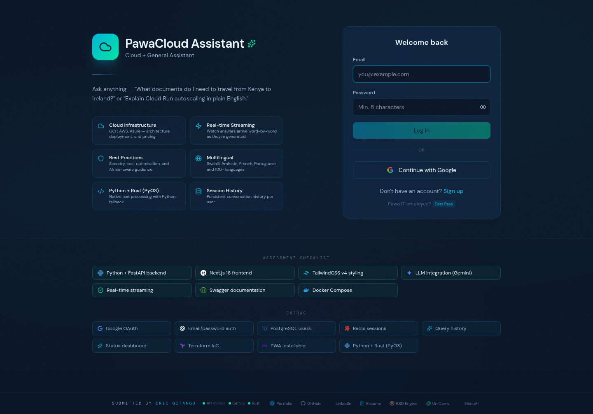
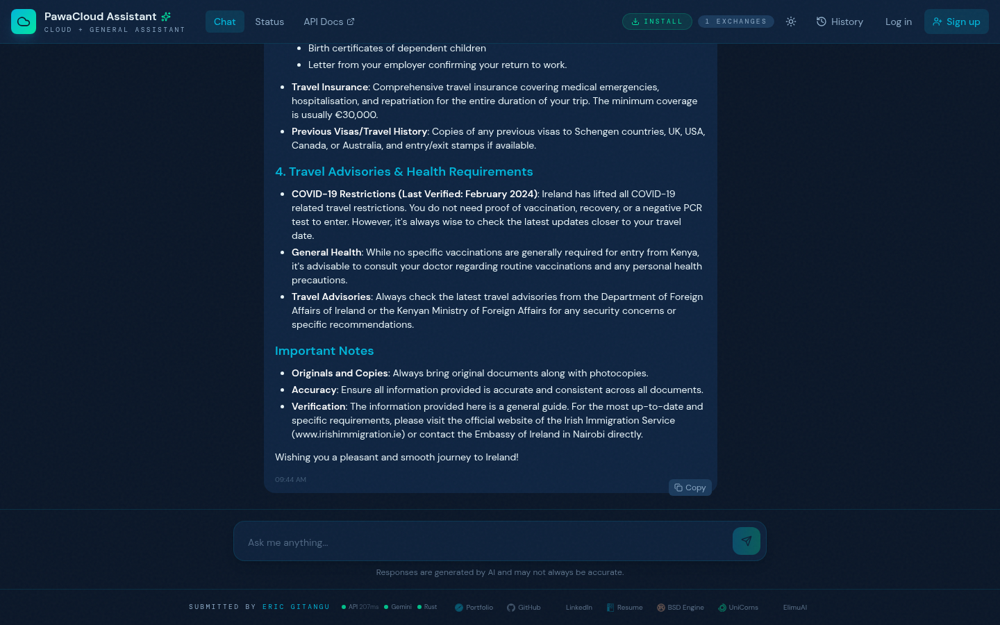
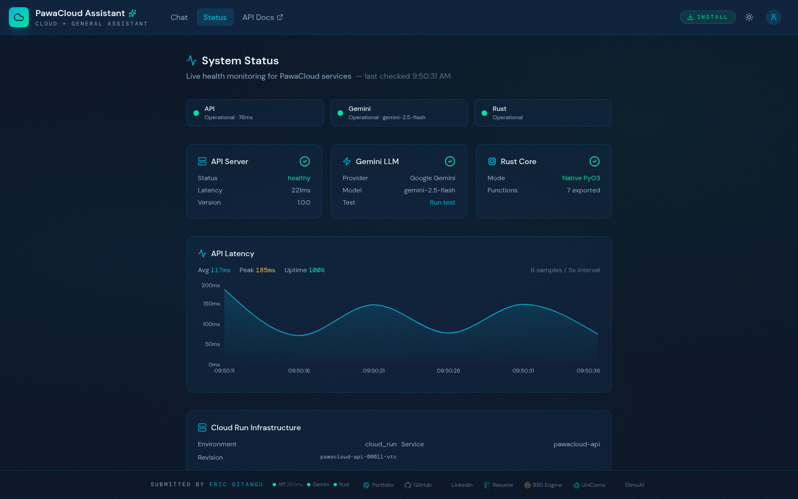
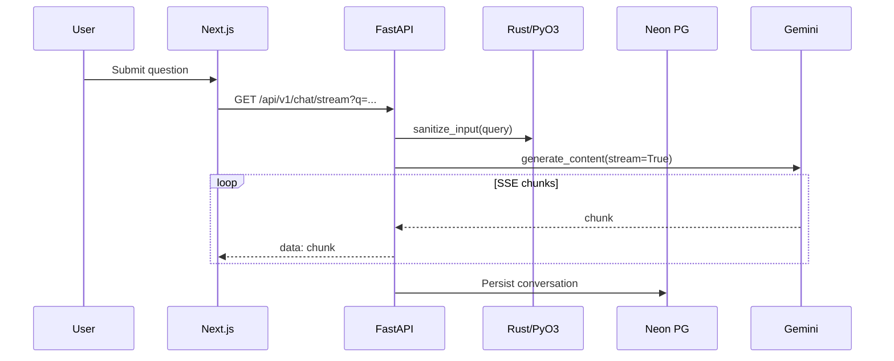
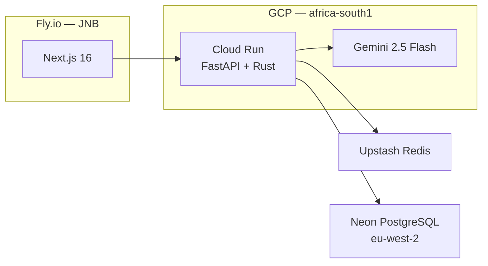

# PawaCloud Assistant - Pre-screening assessment

AI-powered chatbot with Gemini, Rust+PyO3 text processing, and GCP deployment.

[](https://github.com/ericgitangu/pawacloud-assistant/actions/workflows/ci.yml)
[](https://github.com/ericgitangu/pawacloud-assistant/actions/workflows/codeql.yml)
[](https://api.securityscorecards.dev/projects/github.com/ericgitangu/pawacloud-assistant)

[](https://github.com/ericgitangu/pawacloud-assistant/pulls)
[](https://conventionalcommits.org)


**Live demo**: [pawacloud-web.fly.dev](https://pawacloud-web.fly.dev) · **API docs**: [/docs](https://pawacloud-api-904401126919.africa-south1.run.app/docs)

## Screenshots

Screenshots are available in the `public/screenshots` directory. Here are some of them showing several functional units:

### Login — auth options + assessment checklist



### Chat — the assessment example query with formatted response



### Chat History — persistent conversations across sessions


### Status — live metrics, latency chart, Cloud Run infrastructure



---

## Live

| Service | URL |
|---------|-----|
| Frontend | [pawacloud-web.fly.dev](https://pawacloud-web.fly.dev) |
| Backend API | [pawacloud-api](https://pawacloud-api-904401126919.africa-south1.run.app) |
| Swagger | [/docs](https://pawacloud-api-904401126919.africa-south1.run.app/docs) |
| ReDoc | [/redoc](https://pawacloud-api-904401126919.africa-south1.run.app/redoc) |
| Status | [/status](https://pawacloud-web.fly.dev/status) |

---

## Quick Start

**Prerequisites**: Python 3.12+, [pnpm](https://pnpm.io/installation), Docker (for compose method)

**Optional**: [Rust toolchain](https://rustup.rs) (PyO3 — falls back to Python), [gcloud CLI](https://cloud.google.com/sdk/docs/install) (Cloud Run deploy), [flyctl](https://fly.io/docs/flyctl/install/) (frontend deploy), [Terraform](https://developer.hashicorp.com/terraform/install) (IaC), [Gemini API key](https://aistudio.google.com/apikey) (LLM — app runs without it, returns error on chat)

### Docker Compose (recommended)

```bash
git clone https://github.com/ericgitangu/pawacloud-assistant.git
cd pawacloud-assistant
cp backend/.env.example backend/.env   # add GEMINI_API_KEY
make dev
```

Starts PostgreSQL, Redis, backend, and frontend. Hit <http://localhost:3000>.

### Manual

```bash
# backend
cd backend
python3 -m venv venv && source venv/bin/activate
pip install -r requirements.txt
cp .env.example .env
uvicorn app.main:app --reload --port 8000

# frontend (new terminal)
cd frontend
pnpm install
cp .env.example .env.local
pnpm run dev
```

### With Rust PyO3

```bash
cd backend && python3 -m venv venv && source venv/bin/activate
cd ../rust-core && pip install maturin && maturin develop --release
cd ../backend && uvicorn app.main:app --reload --port 8000
```

### Tests

```bash
make test                    # backend: 27 pytest cases + doctests
cd frontend && pnpm build    # frontend: typecheck + build
cd rust-core && cargo test   # rust (runs inside Docker build)
```

---

## API

| Method | Endpoint | Purpose |
|--------|----------|---------|
| `POST` | `/api/v1/chat` | Query → complete response |
| `GET` | `/api/v1/chat/stream?q=` | Query → SSE stream |
| `GET` | `/api/v1/chat/history` | Paginated history (per user) |
| `DELETE` | `/api/v1/chat/history/{id}` | Delete single conversation |
| `DELETE` | `/api/v1/chat/history` | Clear all history |
| `POST` | `/api/v1/documents/upload` | Multipart upload → `ArtifactSummary` |
| `GET` | `/api/v1/documents/{id}/process` | SSE stream: summarize or translate |
| `GET` | `/health` | Health + model metadata |
| `GET` | `/health/metrics` | PyO3 benchmarks + Redis stats |
| `GET` | `/health/events` | Event registry introspection |
| `GET` | `/health/infra` | Cloud Run / Fly.io env info |
| `GET` | `/health/llm` | Live Gemini connectivity test |
| `GET` | `/auth/login` | → Google OAuth consent |
| `GET` | `/auth/callback` | OAuth code → session |
| `POST` | `/auth/signup` | Create email/password account |
| `POST` | `/auth/login` | Email/password login |
| `GET` | `/auth/me` | Current user |
| `POST` | `/auth/logout` | Clear session |
| `POST` | `/auth/guest-pass` | 60-min session for `@pawait.co.ke` |

**Document pipeline** — upload PDF/DOCX/JPG/PNG, summarize or translate via SSE → see [docs/documents.md](docs/documents.md).

All endpoints return typed Pydantic v2 models. Input sanitized via Rust PyO3 (Python fallback). See [Swagger](https://pawacloud-api-904401126919.africa-south1.run.app/docs) for request/response schemas.

---

## Auth

Three methods, sessions via HMAC-signed tokens (Redis-independent):

| Method | TTL | Notes |
|--------|-----|-------|
| Google OAuth | 24h | OpenID Connect |
| Email + password | 24h | bcrypt, PostgreSQL |
| Guest Pass | 60min | `@pawait.co.ke` — no signup needed |

History is keyed by email, not session ID — persists across sign-out/sign-in and survives Cloud Run cold starts. Chat conversations stored in PostgreSQL (Neon.tech, `aws-eu-west-2`) with in-memory cache for fast reads.

**For Pawa IT reviewers**: click "Fast Pass" on login, enter any `@pawait.co.ke` email.

---

## Architecture





Backend on Cloud Run (`africa-south1`), frontend on Fly.io (JNB). Terraform IaC in `infra/`. Details in [docs/ARCHITECTURE.md](docs/ARCHITECTURE.md).

---

## Rust PyO3

Text processing on every request and response. Optional — falls back to pure Python.

| Function | Rust | Python | Speedup |
|----------|------|--------|---------|
| `sanitize_input` (1KB) | ~0.9us | ~45us | ~50x |
| `estimate_tokens` (4KB) | ~1.2us | ~120us | ~100x |
| `validate_markdown` (8KB) | ~2.1us | ~80us | ~38x |

Live benchmarks at [`/health/metrics`](https://pawacloud-api-904401126919.africa-south1.run.app/health/metrics).

---

## Project Structure

```yaml
pawacloud-assistant/
├── backend/
│   ├── app/
│   │   ├── main.py              FastAPI + session middleware
│   │   ├── core/                config, decorators, middleware
│   │   ├── models/schemas.py    Pydantic v2 models
│   │   ├── routers/             chat, auth, health
│   │   └── services/            llm, history, text processing
│   ├── tests/test_api.py
│   └── Dockerfile
├── rust-core/                   PyO3 bindings (7 functions)
├── frontend/
│   ├── app/                     pages (chat, status, login, signup)
│   ├── components/              12 components
│   ├── lib/api.ts               fetch + SSE + auth helpers
│   └── Dockerfile
├── infra/                       Terraform (Cloud Run + Artifact Registry)
├── public/
│   └── screenshots/             Login, Chat, History, Status PNGs
├── docs/
│   ├── ARCHITECTURE.md
│   ├── PROMPTS.md
│   └── EVALUATION.md            Assessment criteria mapping
├── scripts/                     deploy-backend.sh, deploy-frontend.sh
├── docker-compose.yml           Full stack (Postgres + Redis + backend + frontend)
└── Makefile
```

---

## Deployment

```bash
# backend → Cloud Run
bash scripts/deploy-backend.sh

# frontend → Fly.io
bash scripts/deploy-frontend.sh

# or Terraform
cd infra && terraform init && terraform apply
```

---

## Prompt Engineering

System prompt in `services/llm_service.py`. Details in [docs/PROMPTS.md](docs/PROMPTS.md).

- Persona: GCP specialist tied to Pawa IT
- Africa-aware: regional availability, cost, connectivity
- Multilingual: responds in user's language, keeps technical terms in English
- Honesty: "if you don't know, say so"

---

## Troubleshooting

| Issue | Fix |
|-------|-----|
| `GEMINI_API_KEY not set` | Copy `backend/.env.example` to `backend/.env` and add your key from [aistudio.google.com/apikey](https://aistudio.google.com/apikey) |
| Frontend redirects to `/login` endlessly | The `pawacloud_auth` cookie isn't set — clear cookies and log in again, or check `NEXT_PUBLIC_API_URL` points to a running backend |
| `pnpm: command not found` | `corepack enable && corepack prepare pnpm@9.15.0 --activate` (requires Node 18+) |
| CORS errors in browser console | Ensure `ALLOWED_ORIGINS` in `backend/.env` includes your frontend URL (default: `http://localhost:3000`) |
| `maturin develop` fails | Rust toolchain missing — `curl --proto '=https' --tlsv1.2 -sSf https://sh.rustup.rs \| sh`. Or skip it entirely; Python fallback handles everything |
| Docker compose: port 5432 in use | Local PostgreSQL is running — `brew services stop postgresql` or change the port in `docker-compose.yml` |
| History empty after login | Set `DATABASE_URL` in `backend/.env` for persistent history. Without it, history is in-memory and lost on restart. Redis is optional (session cache only) |
| OAuth callback fails locally | Set `OAUTH_REDIRECT_URI=http://localhost:8000/auth/callback` and `FRONTEND_URL=http://localhost:3000` in `backend/.env`. Google Console must list the redirect URI |

---

## Evaluation

Assessment criteria mapping, what's beyond requirements, and what I'd do with more time: [docs/EVALUATION.md](docs/EVALUATION.md).

---

**Eric Gitangu** · [resume](https://resume.ericgitangu.com) · [linkedin](https://linkedin.com/in/ericgitangu) · [github](https://github.com/ericgitangu)
