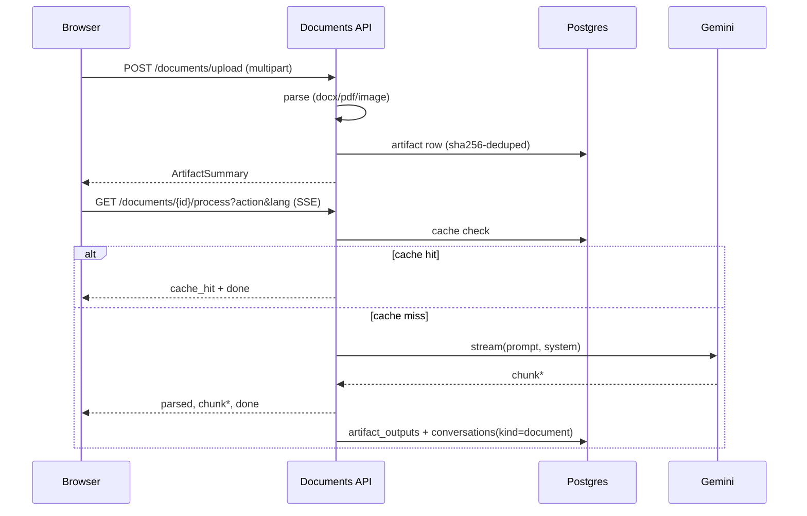

# Architecture

Three layers, loosely coupled:

1. **Backend** — FastAPI (Python 3.12), handles chat/streaming/history/auth
2. **Frontend** — Next.js 16 + TailwindCSS v4, SSE streaming, PWA
3. **Rust Core** — PyO3 bindings for text processing, falls back to Python if not compiled

## Request flow

```yaml
Browser → Next.js middleware (auth gate) → page.tsx
  ↓ SSE
FastAPI /chat/stream → sanitize (Rust/Python) → Gemini 2.5 Flash → stream chunks
  ↓
Conversation persisted to PostgreSQL (keyed by user email for authenticated users)
```

## Auth

Two paths, all produce an HMAC-signed Bearer token stored in localStorage:

- Google OAuth (redirect flow → signed token exchange)
- Email/password (bcrypt, PostgreSQL)

Frontend sends `Authorization: Bearer <token>` on every API call — no cross-origin cookie dependency. Redis stores session blobs as a fallback for cookie-based sessions. Frontend middleware checks `pawacloud_auth` cookie for route gating; no cookie → `/login`.

## Data stores

- **PostgreSQL (Neon, eu-west-2)** — user accounts + chat history (`conversations` table, indexed by session/email)
- **Redis (Upstash)** — session cache (JSON blob, TTL'd). Fallback auth path when Bearer tokens aren't present
- In-memory deque as read cache for history; falls back to in-memory-only if both stores are unavailable

## Deployment

- Backend: GCP Cloud Run (africa-south1) — multi-stage Docker builds Rust, installs Python deps
- Frontend: Fly.io (JNB) — standalone Next.js output
- Infra: Terraform configs in `infra/` (Cloud Run + Artifact Registry + IAM)

## Why Rust

PyO3 bridge for text ops on every request/response.
7 functions: sanitize, tokenize, validate markdown, extract code blocks, format sources, truncate, similarity.
Live benchmarks at `/health/metrics`. Optional — Python fallback works identically.

## Document pipeline

Two-step BFF: upload returns parsed metadata; process opens an SSE stream
keyed by artifact id + action + target language. Cache-first — Postgres
holds parsed text and per-action outputs; identical re-requests bypass the
LLM.



See [docs/documents.md](documents.md) for the full walkthrough.
