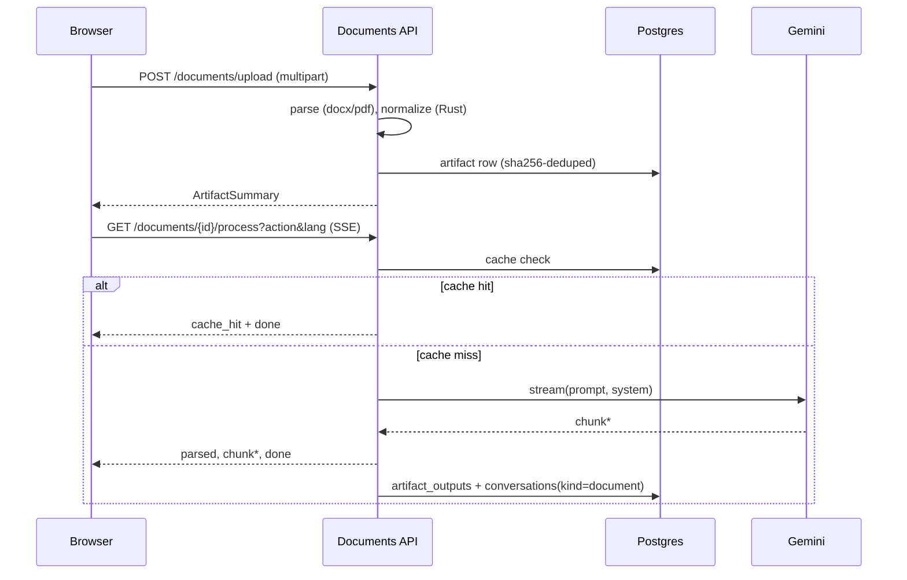

# Document Upload, Summarize, Translate — Implementation Plan

> **For agentic workers:** REQUIRED SUB-SKILL: Use superpowers:subagent-driven-development (recommended) or superpowers:executing-plans to implement this plan task-by-task. Steps use checkbox (`- [ ]`) syntax for tracking.

**Goal:** Add document upload (PDF/DOCX) with LLM-powered summarize and translate, streamed into the existing chat thread, with cache-first behaviour and client-side download in 4 formats.

**Architecture:** Two-step BFF (`POST /documents/upload` → `GET /documents/{id}/process` SSE). New `artifacts` + `artifact_outputs` PG tables; `conversations` gains `kind` + `artifact_id` for the unified timeline. Rust+PyO3 extensions (`document.rs`) for sha256, script detection, document-aware normalization, and token-budgeted markdown chunking. Frontend: shadcn primitives, sonner toasts paired with `navigator.vibrate` haptics, lazy-loaded md/txt/docx/pdf renderers.

**Tech Stack:** Python 3.12, FastAPI, Pydantic v2, asyncpg, redis-py, pypdf, python-docx, google-cloud-vision (lazy), Rust 1.78 + PyO3 0.22, Next.js 16 + React 19 + TailwindCSS v4, shadcn-ui, sonner, marked, docx, jspdf, html2canvas.

**Spec:** `docs/superpowers/specs/2026-04-29-document-upload-translate-summarize-design.md`

**Conventions enforced everywhere:**
- Lint + typecheck must pass before every commit (husky pre-commit; do not bypass with `--no-verify`).
- Conventional Commits prefixes (`feat:`, `fix:`, `chore:`, `docs:`, `test:`).
- Lower-case body, no period, no adjectives like "elegant" / "robust".
- No `Co-Authored-By` lines, no AI attribution anywhere — code, commits, docs.
- New source files include SPDX header (`// SPDX-License-Identifier: MIT` or `# SPDX-License-Identifier: MIT`). Existing files are not retroactively stamped.

---

## File map

### Created

```
LICENSE                                              MIT, Eric Gitangu, 2026
backend/app/core/events.py                           event registry + emit_event helper
backend/app/services/document_processing.py          rust-or-py fallback wrapper
backend/app/services/document_service.py             parse + orchestration + cache
backend/app/routers/documents.py                     upload + process endpoints
backend/tests/test_document_processing.py            doctest + unit
backend/tests/test_documents_api.py                  fastapi behaviour tests
backend/tests/fixtures/sample.docx                   binary (script-generated)
backend/tests/fixtures/sample.pdf                    binary (script-generated)
backend/scripts/make-fixtures.py                     one-shot fixture generator
rust-core/src/document.rs                            sha256_hex, detect_script,
                                                     normalize_document_text, chunk_markdown
frontend/lib/events.ts                               registry mirror + dev assertion
frontend/lib/haptics.ts                              navigator.vibrate wrappers
frontend/lib/toast.ts                                sonner + haptics pairing
frontend/lib/render/docx.ts                          lazy: marked → docx → Blob
frontend/lib/render/pdf.ts                           lazy: marked → jspdf → Blob
frontend/components/DocumentUploadDialog.tsx         dialog/sheet, drag-drop, action+lang picker
frontend/components/LanguagePicker.tsx               12 chips + "Other…" sheet
frontend/components/ArtifactCard.tsx                 user-side bubble
frontend/components/ArtifactOutputBubble.tsx         assistant-side, ReactMarkdown + DownloadMenu
frontend/components/DownloadMenu.tsx                 4-format dropdown
frontend/components/ui/*                             shadcn-generated, not hand-edited
docs/DOCUMENTS.md                                    feature walkthrough
docs/QA-DOCUMENTS.md                                 manual QA checklist
```

### Modified

```
backend/requirements.txt                             python-multipart, python-docx, pypdf, google-cloud-vision
backend/app/main.py                                  register documents router
backend/app/core/config.py                           VISION_ENABLED + DOCUMENT_CACHE_TTL settings
backend/app/core/database.py                         create artifacts + artifact_outputs tables, alter conversations
backend/app/models/schemas.py                        ArtifactWarning, ArtifactSummary; HistoryItem.kind+artifact
backend/app/services/history_service.py              add() accepts kind + artifact_id
backend/app/services/text_processing.py              expose RUST_AVAILABLE flag (already exists, leave intact)
backend/app/routers/health.py                        /health/events + extend /health/metrics
rust-core/src/lib.rs                                 register document module + functions
frontend/package.json                                marked, docx, jspdf, html2canvas, sonner, shadcn deps
frontend/app/layout.tsx                              <Toaster /> mount
frontend/app/page.tsx                                upload flow wiring; remove Snackbar usage
frontend/lib/api.ts                                  uploadDocument + streamDocumentProcess + types
frontend/components/ChatInput.tsx                    paperclip button
frontend/components/MessageBubble.tsx                kind-discriminated render
frontend/components/HistoryPanel.tsx                 paperclip badge for kind='document'
docs/ARCHITECTURE.md                                 "Document pipeline" section + sequence diagram
docs/PROMPTS.md                                      summarize + translate prompt addendum
infra/main.tf                                        optional log-based metric (feature-flagged)
```

### Deleted

```
frontend/components/Snackbar.tsx                     replaced by sonner via lib/toast.ts
```

---

## Phase 0 — Foundations (license + commit baseline)

### Task 0.1: Add MIT LICENSE

**Files:**
- Create: `LICENSE`

- [ ] **Step 1: Write the LICENSE file**

```
MIT License

Copyright (c) 2026 Eric Gitangu

Permission is hereby granted, free of charge, to any person obtaining a copy
of this software and associated documentation files (the "Software"), to deal
in the Software without restriction, including without limitation the rights
to use, copy, modify, merge, publish, distribute, sublicense, and/or sell
copies of the Software, and to permit persons to whom the Software is
furnished to do so, subject to the following conditions:

The above copyright notice and this permission notice shall be included in all
copies or substantial portions of the Software.

THE SOFTWARE IS PROVIDED "AS IS", WITHOUT WARRANTY OF ANY KIND, EXPRESS OR
IMPLIED, INCLUDING BUT NOT LIMITED TO THE WARRANTIES OF MERCHANTABILITY,
FITNESS FOR A PARTICULAR PURPOSE AND NONINFRINGEMENT. IN NO EVENT SHALL THE
AUTHORS OR COPYRIGHT HOLDERS BE LIABLE FOR ANY CLAIM, DAMAGES OR OTHER
LIABILITY, WHETHER IN AN ACTION OF CONTRACT, TORT OR OTHERWISE, ARISING FROM,
OUT OF OR IN CONNECTION WITH THE SOFTWARE OR THE USE OR OTHER DEALINGS IN THE
SOFTWARE.
```

- [ ] **Step 2: Commit**

```bash
git add LICENSE
git commit -m "chore: add mit license"
```

---

## Phase 1 — Backend foundations

### Task 1.1: Add backend dependencies

**Files:**
- Modify: `backend/requirements.txt`

- [ ] **Step 1: Append new deps**

Append to `backend/requirements.txt`:

```
python-multipart==0.0.20
python-docx==1.2.0
pypdf==5.7.0
google-cloud-vision==3.10.2
```

- [ ] **Step 2: Install in venv**

Run:

```bash
cd backend && . venv/bin/activate && pip install -r requirements.txt
```

Expected: all four resolve and install cleanly.

- [ ] **Step 3: Commit**

```bash
git add backend/requirements.txt
git commit -m "chore: add document parsing + vision deps"
```

---

### Task 1.2: Add config settings for document feature

**Files:**
- Modify: `backend/app/core/config.py`

- [ ] **Step 1: Add fields to Settings**

Inside `Settings(BaseSettings)`, after the Gemini fields, add:

```python
    # Document processing
    DOCUMENT_MAX_BYTES: int = Field(default=10 * 1024 * 1024)
    DOCUMENT_MAX_PAGES: int = Field(default=100)
    DOCUMENT_CACHE_TTL_PARSED: int = Field(default=86400)        # 24h Redis TTL for parsed text
    DOCUMENT_CACHE_TTL_OUTPUT: int = Field(default=604800)       # 7d Redis TTL for LLM outputs
    DOCUMENT_CHUNK_BUDGET: int = Field(default=80_000)           # max tokens per chunk
    DOCUMENT_SINGLE_PASS_LIMIT: int = Field(default=120_000)     # threshold for map-reduce
    DOCUMENT_OCR_CHAR_THRESHOLD: int = Field(default=40)         # chars/page below this → try OCR

    GOOGLE_VISION_KEY_PATH: str = Field(default="", description="Service account JSON path for Cloud Vision OCR")
```

- [ ] **Step 2: Run existing tests to confirm no regression**

Run:

```bash
cd backend && . venv/bin/activate && python -m pytest tests/ -v
```

Expected: all existing tests pass (config additions are additive, default values are safe).

- [ ] **Step 3: Commit**

```bash
git add backend/app/core/config.py
git commit -m "feat: config knobs for document pipeline"
```

---

### Task 1.3: Pydantic schemas — artifact + extended history

**Files:**
- Modify: `backend/app/models/schemas.py`

- [ ] **Step 1: Add the new schemas**

Append to `backend/app/models/schemas.py`:

```python
from typing import Literal


class ArtifactWarning(BaseModel):
    """Non-fatal parse condition surfaced to the client."""

    code: Literal["scanned_no_ocr", "truncated", "large_file"]
    message: str


class ArtifactSummary(BaseModel):
    """Result of an upload — all the metadata the frontend renders in the artifact card."""

    id: UUID
    filename: str
    mime: str
    byte_size: int
    page_count: int
    char_count: int
    source_lang: str | None = None
    parsed_preview: str
    parse_method: Literal["docx", "pdf-text", "pdf-ocr", "pdf-empty"]
    warnings: list[ArtifactWarning] = Field(default_factory=list)
    created_at: datetime
```

Then update `HistoryItem`:

```python
class HistoryItem(BaseModel):
    """Single conversation turn — chat or document."""

    id: UUID
    kind: Literal["chat", "document"] = "chat"
    query: str
    response: str
    model: str
    tokens_used: int | None = None
    created_at: datetime
    artifact: ArtifactSummary | None = None
```

- [ ] **Step 2: Run schema-related tests**

Run:

```bash
cd backend && . venv/bin/activate && python -m pytest tests/ -v
```

Expected: all existing tests pass — the additions are backward-compatible (`kind` defaults to `'chat'`, `artifact` defaults to `None`).

- [ ] **Step 3: Lint + format**

Run:

```bash
cd backend && . venv/bin/activate && ruff check app/ && ruff format app/ --check
```

Expected: zero errors, zero diff.

- [ ] **Step 4: Commit**

```bash
git add backend/app/models/schemas.py
git commit -m "feat: artifact schemas + extend history item with kind"
```

---

### Task 1.4: Database migration — new tables + conversations columns

**Files:**
- Modify: `backend/app/core/database.py`

- [ ] **Step 1: Extend init_db() with new tables and ALTER**

Inside the `async with _pool.acquire() as conn:` block in `init_db()`, after the existing `CREATE TABLE IF NOT EXISTS conversations` and its index, append:

```python
            await conn.execute("""
                CREATE TABLE IF NOT EXISTS artifacts (
                    id UUID PRIMARY KEY DEFAULT gen_random_uuid(),
                    sha256 CHAR(64) NOT NULL,
                    owner_email TEXT NOT NULL,
                    filename TEXT NOT NULL,
                    mime TEXT NOT NULL,
                    byte_size INTEGER NOT NULL,
                    page_count INTEGER NOT NULL,
                    char_count INTEGER NOT NULL,
                    source_lang TEXT,
                    parsed_text TEXT NOT NULL,
                    parse_method TEXT NOT NULL,
                    warnings JSONB DEFAULT '[]'::jsonb,
                    created_at TIMESTAMPTZ DEFAULT now()
                )
            """)
            await conn.execute("""
                CREATE UNIQUE INDEX IF NOT EXISTS idx_artifacts_owner_sha
                ON artifacts (owner_email, sha256)
            """)
            await conn.execute("""
                CREATE TABLE IF NOT EXISTS artifact_outputs (
                    id UUID PRIMARY KEY DEFAULT gen_random_uuid(),
                    artifact_id UUID NOT NULL REFERENCES artifacts(id) ON DELETE CASCADE,
                    action TEXT NOT NULL,
                    target_lang TEXT NOT NULL,
                    content TEXT NOT NULL,
                    model TEXT NOT NULL,
                    tokens_used INTEGER,
                    created_at TIMESTAMPTZ DEFAULT now()
                )
            """)
            await conn.execute("""
                CREATE UNIQUE INDEX IF NOT EXISTS idx_outputs_artifact_action_lang
                ON artifact_outputs (artifact_id, action, target_lang)
            """)
            await conn.execute("""
                ALTER TABLE conversations
                ADD COLUMN IF NOT EXISTS kind TEXT NOT NULL DEFAULT 'chat'
            """)
            await conn.execute("""
                ALTER TABLE conversations
                ADD COLUMN IF NOT EXISTS artifact_id UUID REFERENCES artifacts(id) ON DELETE SET NULL
            """)
```

- [ ] **Step 2: Update log message**

Change `logger.info("postgres connected, users table ready")` to:

```python
        logger.info("postgres connected, schema ready (users + conversations + artifacts)")
```

- [ ] **Step 3: Run existing tests**

Run:

```bash
cd backend && . venv/bin/activate && python -m pytest tests/ -v
```

Expected: all existing tests pass. (Tests don't require a live PG; failures here would point to a syntax error in the new SQL.)

- [ ] **Step 4: Commit**

```bash
git add backend/app/core/database.py
git commit -m "feat: pg schema for artifacts + conversations.kind"
```

---

### Task 1.5: Event registry module

**Files:**
- Create: `backend/app/core/events.py`

- [ ] **Step 1: Write the failing test (event registry contract)**

Append to `backend/tests/test_api.py`:

```python
class TestEventRegistry:
    def test_event_registry_endpoint(self, client):
        resp = client.get("/health/events")
        assert resp.status_code == 200
        data = resp.json()
        assert set(data["registered"]) == {
            "parsed", "cache_hit", "chunk", "progress", "done", "error"
        }
        assert "descriptions" in data

    def test_event_metrics_in_health_metrics(self, client):
        resp = client.get("/health/metrics")
        assert resp.status_code == 200
        data = resp.json()
        assert "events" in data
        assert isinstance(data["events"]["counts_since_start"], dict)
```

- [ ] **Step 2: Run to confirm it fails**

```bash
cd backend && . venv/bin/activate && python -m pytest tests/test_api.py::TestEventRegistry -v
```

Expected: FAIL with `404` on `/health/events`.

- [ ] **Step 3: Create the events module**

Create `backend/app/core/events.py`:

```python
# SPDX-License-Identifier: MIT
"""Event registry + emit_event for the document pipeline."""

import logging
from collections import Counter
from enum import StrEnum

from starlette.requests import Request

logger = logging.getLogger(__name__)


class EventCode(StrEnum):
    PARSED = "parsed"
    CACHE_HIT = "cache_hit"
    CHUNK = "chunk"
    PROGRESS = "progress"
    DONE = "done"
    ERROR = "error"


EVENT_REGISTRY: dict[EventCode, str] = {
    EventCode.PARSED: "Document parsed; emits token + chunk count",
    EventCode.CACHE_HIT: "Cached output returned; no LLM call made",
    EventCode.CHUNK: "Streamed markdown fragment from the LLM",
    EventCode.PROGRESS: "Map-reduce phase update (>120k token docs)",
    EventCode.DONE: "Stream complete; emits final token count",
    EventCode.ERROR: "Generic error envelope; details in server logs",
}

# in-memory counter — reset on process restart, exposed via /health/metrics
_counter: Counter[str] = Counter()


def emit_event(request: Request | None, code: EventCode, **fields) -> dict:
    """Record event for telemetry and return its JSON wire shape."""
    if code not in EVENT_REGISTRY:
        raise ValueError(f"unregistered event code: {code}")

    _counter[str(code)] += 1

    extra = {
        "event_code": str(code),
        "session_id": getattr(request.state, "session_id", None) if request else None,
        "user_email": (
            getattr(request.state, "user", None) or {}
        ).get("email") if request else None,
    }
    if request:
        extra["trace"] = request.headers.get("x-cloud-trace-context")
    extra.update(fields)
    logger.info("doc.event", extra=extra)

    return {"type": str(code), **fields}


def event_counts() -> dict[str, int]:
    """Snapshot of cumulative counts since process start."""
    return {code: _counter.get(code, 0) for code in EVENT_REGISTRY}
```

- [ ] **Step 4: Add /health/events endpoint and extend /health/metrics**

Modify `backend/app/routers/health.py`:

After the existing imports, add:

```python
from app.core.events import EVENT_REGISTRY, event_counts
```

Then append a new route:

```python
@router.get("/health/events", summary="Event registry introspection", tags=["Health"])
async def events_registry():
    """Lists every event code the document pipeline can emit, with descriptions."""
    return {
        "registered": [str(code) for code in EVENT_REGISTRY],
        "descriptions": {str(code): desc for code, desc in EVENT_REGISTRY.items()},
        "counts_since_start": event_counts(),
    }
```

In `metrics()`, just before the `return {...}`, add:

```python
    events_block = {
        "registered": [str(code) for code in EVENT_REGISTRY],
        "counts_since_start": event_counts(),
    }
```

And add `"events": events_block,` to the returned dict.

- [ ] **Step 5: Run tests to confirm pass**

```bash
cd backend && . venv/bin/activate && python -m pytest tests/test_api.py::TestEventRegistry -v
```

Expected: both tests PASS.

- [ ] **Step 6: Lint**

```bash
cd backend && . venv/bin/activate && ruff check app/ tests/ && ruff format app/ tests/ --check
```

Expected: clean.

- [ ] **Step 7: Commit**

```bash
git add backend/app/core/events.py backend/app/routers/health.py backend/tests/test_api.py
git commit -m "feat: event registry + /health/events introspection"
```

---

## Phase 2 — Rust + PyO3 extensions

### Task 2.1: Add `document.rs` module skeleton

**Files:**
- Create: `rust-core/src/document.rs`
- Modify: `rust-core/src/lib.rs`

- [ ] **Step 1: Write the document.rs skeleton with all four function signatures + doctests + unit tests**

Create `rust-core/src/document.rs`:

```rust
// SPDX-License-Identifier: MIT
//! Document-pipeline utilities — sha256, script detection, normalization, chunking.

use pyo3::prelude::*;
use sha2::{Digest, Sha256};

/// Compute a hex-encoded SHA-256 of the given bytes. Used for upload de-dup.
///
/// ```
/// use pawacloud_core::sha256_hex;
/// assert_eq!(
///     sha256_hex(b"hello"),
///     "2cf24dba5fb0a30e26e83b2ac5b9e29e1b161e5c1fa7425e73043362938b9824"
/// );
/// assert_eq!(sha256_hex(b"").len(), 64);
/// ```
#[pyfunction]
pub fn sha256_hex(bytes: &[u8]) -> String {
    let mut hasher = Sha256::new();
    hasher.update(bytes);
    format!("{:x}", hasher.finalize())
}

/// Detect a likely BCP-47 language hint by Unicode block scan over a sample.
/// Returns one of: "en", "ar", "zh", "ru", "hi", "am", "und".
///
/// ```
/// use pawacloud_core::detect_script;
/// assert_eq!(detect_script("hello world", 1024), "en");
/// assert_eq!(detect_script("مرحبا بالعالم", 1024), "ar");
/// assert_eq!(detect_script("你好世界", 1024), "zh");
/// assert_eq!(detect_script("привет мир", 1024), "ru");
/// assert_eq!(detect_script("नमस्ते दुनिया", 1024), "hi");
/// assert_eq!(detect_script("", 1024), "und");
/// ```
#[pyfunction]
pub fn detect_script(text: &str, sample_chars: usize) -> String {
    let mut counts = [0usize; 6]; // latin, arabic, cjk, cyrillic, devanagari, ethiopic
    let mut total = 0usize;

    for ch in text.chars().take(sample_chars) {
        if !ch.is_alphabetic() {
            continue;
        }
        total += 1;
        let cp = ch as u32;
        match cp {
            0x0041..=0x024F => counts[0] += 1,                    // Latin
            0x0600..=0x06FF | 0x0750..=0x077F => counts[1] += 1,  // Arabic
            0x4E00..=0x9FFF | 0x3400..=0x4DBF => counts[2] += 1,  // CJK
            0x0400..=0x04FF => counts[3] += 1,                    // Cyrillic
            0x0900..=0x097F => counts[4] += 1,                    // Devanagari
            0x1200..=0x137F => counts[5] += 1,                    // Ethiopic (Amharic, Tigrinya)
            _ => {}
        }
    }

    if total == 0 {
        return "und".to_string();
    }

    // require ≥60% dominance from a single block, else "und"
    let (winner_idx, &winner_count) = counts
        .iter()
        .enumerate()
        .max_by_key(|(_, &c)| c)
        .unwrap();

    if winner_count * 100 / total < 60 {
        return "und".to_string();
    }

    match winner_idx {
        0 => "en",
        1 => "ar",
        2 => "zh",
        3 => "ru",
        4 => "hi",
        5 => "am",
        _ => "und",
    }
    .to_string()
}

/// Normalize document text — preserves paragraph breaks (distinct from `sanitize_input`
/// which collapses all whitespace). Strips control chars, collapses spaces inside
/// paragraphs, dedupes consecutive blank lines, normalizes line endings to `\n`.
///
/// ```
/// use pawacloud_core::normalize_document_text;
/// assert_eq!(normalize_document_text("a\r\n\r\n\r\nb"), "a\n\nb");
/// assert_eq!(normalize_document_text("foo   bar\nbaz"), "foo bar\nbaz");
/// assert_eq!(normalize_document_text("hello\x00world"), "helloworld");
/// ```
#[pyfunction]
pub fn normalize_document_text(raw: &str) -> String {
    let unified = raw.replace("\r\n", "\n").replace('\r', "\n");

    let mut out = String::with_capacity(unified.len());
    let mut blank_streak = 0usize;

    for line in unified.split('\n') {
        let cleaned: String = line
            .chars()
            .filter(|c| !c.is_control() || *c == '\t')
            .collect();
        let collapsed: String = cleaned.split_whitespace().collect::<Vec<_>>().join(" ");

        if collapsed.is_empty() {
            blank_streak += 1;
            if blank_streak <= 1 {
                out.push('\n');
            }
        } else {
            blank_streak = 0;
            if !out.is_empty() && !out.ends_with('\n') {
                out.push('\n');
            }
            out.push_str(&collapsed);
        }
    }

    out.trim_matches('\n').to_string()
}

/// Token-budgeted markdown chunker. Splits on heading boundaries first, then
/// paragraph boundaries. Never splits mid-sentence; respects the budget loosely
/// (won't split a single oversize paragraph — caller can apply secondary truncation).
///
/// ```
/// use pawacloud_core::chunk_markdown;
/// let chunks = chunk_markdown("## A\npara one.\n\n## B\npara two.", 100);
/// assert_eq!(chunks.len(), 1);  // small doc fits in one chunk
/// let big: String = (0..50).map(|_| "## H\nx\n\n").collect();
/// let chunks = chunk_markdown(&big, 50);
/// assert!(chunks.len() > 1);
/// ```
#[pyfunction]
pub fn chunk_markdown(text: &str, max_tokens: usize) -> Vec<String> {
    fn estimate(s: &str) -> usize {
        let chars = s.len();
        let words = s.split_whitespace().count();
        (chars / 4 + words * 4 / 3) / 2
    }

    if estimate(text) <= max_tokens {
        return vec![text.to_string()];
    }

    let blocks: Vec<&str> = text.split("\n\n").collect();
    let mut chunks = Vec::new();
    let mut current = String::new();

    for block in blocks {
        let block_tokens = estimate(block);
        let current_tokens = estimate(&current);

        if !current.is_empty() && current_tokens + block_tokens > max_tokens {
            chunks.push(current.trim().to_string());
            current = String::new();
        }

        if !current.is_empty() {
            current.push_str("\n\n");
        }
        current.push_str(block);
    }

    if !current.trim().is_empty() {
        chunks.push(current.trim().to_string());
    }

    chunks
}

#[cfg(test)]
mod tests {
    use super::*;

    #[test]
    fn sha256_hex_known_vector() {
        assert_eq!(
            sha256_hex(b"abc"),
            "ba7816bf8f01cfea414140de5dae2223b00361a396177a9cb410ff61f20015ad"
        );
    }

    #[test]
    fn sha256_hex_empty() {
        assert_eq!(sha256_hex(b"").len(), 64);
    }

    #[test]
    fn detect_script_mixed_returns_und() {
        // 50/50 mix should be 'und' since neither side hits 60%
        let mixed = "abcde مرحبا";
        let result = detect_script(mixed, 1024);
        assert_eq!(result, "und");
    }

    #[test]
    fn detect_script_ethiopic() {
        assert_eq!(detect_script("ሰላም ዓለም", 1024), "am");
    }

    #[test]
    fn normalize_strips_control_keeps_paragraph() {
        let raw = "Para one\x00 stuff\n\nPara two\n\n\n\nPara three";
        let out = normalize_document_text(raw);
        assert_eq!(out, "Para one stuff\n\nPara two\n\nPara three");
    }

    #[test]
    fn normalize_handles_windows_line_endings() {
        assert_eq!(
            normalize_document_text("line1\r\nline2\r\n\r\nline3"),
            "line1\nline2\n\nline3"
        );
    }

    #[test]
    fn chunk_markdown_splits_when_oversize() {
        let big: String = (0..200).map(|i| format!("para {i} with words.\n\n")).collect();
        let chunks = chunk_markdown(&big, 100);
        assert!(chunks.len() > 1);
    }

    #[test]
    fn chunk_markdown_single_when_small() {
        let chunks = chunk_markdown("short doc", 1000);
        assert_eq!(chunks.len(), 1);
        assert_eq!(chunks[0], "short doc");
    }
}
```

- [ ] **Step 2: Add `sha2` to Cargo.toml**

Modify `rust-core/Cargo.toml`, in `[dependencies]`:

```toml
sha2 = "0.10"
```

- [ ] **Step 3: Register the module in lib.rs**

Modify `rust-core/src/lib.rs`:

Add module declaration and re-exports (keep existing lines intact):

```rust
pub mod document;
pub mod markdown;
pub mod response;
pub mod text;

pub use document::{chunk_markdown, detect_script, normalize_document_text, sha256_hex};
pub use markdown::{extract_code_blocks, validate_markdown};
pub use response::{compute_similarity, format_sources, truncate_response};
pub use text::{estimate_tokens, sanitize_input};
```

In the `#[pymodule] fn pawacloud_core(...)` body, register the new functions:

```rust
    m.add_function(wrap_pyfunction!(document::sha256_hex, m)?)?;
    m.add_function(wrap_pyfunction!(document::detect_script, m)?)?;
    m.add_function(wrap_pyfunction!(document::normalize_document_text, m)?)?;
    m.add_function(wrap_pyfunction!(document::chunk_markdown, m)?)?;
```

- [ ] **Step 4: Run cargo tests**

```bash
cd rust-core && cargo test --lib
```

Expected: all unit tests + doctests pass (existing 7 functions' tests + new 4 functions' tests + doctests).

- [ ] **Step 5: Run cargo fmt + clippy**

```bash
cd rust-core && cargo fmt --check && cargo clippy -- -D warnings
```

Expected: clean.

- [ ] **Step 6: Build the wheel and install into the venv**

```bash
cd backend && . venv/bin/activate && cd ../rust-core && maturin develop --release
```

Expected: builds + installs the updated `pawacloud_core` extension module.

- [ ] **Step 7: Smoke-test from Python**

```bash
cd backend && . venv/bin/activate && python -c "from pawacloud_core import sha256_hex, detect_script, normalize_document_text, chunk_markdown; print(sha256_hex(b'abc')[:16], detect_script('hello', 1024), normalize_document_text('a\r\n\r\nb'))"
```

Expected: `ba7816bf8f01cfea en a\n\nb` (or similar — confirms the four new functions are callable).

- [ ] **Step 8: Commit**

```bash
git add rust-core/src/document.rs rust-core/src/lib.rs rust-core/Cargo.toml rust-core/Cargo.lock
git commit -m "feat: rust pyo3 helpers for document pipeline"
```

---

### Task 2.2: Python wrapper with fallback

**Files:**
- Create: `backend/app/services/document_processing.py`
- Create: `backend/tests/test_document_processing.py`

- [ ] **Step 1: Write the failing doctest + behaviour test**

Create `backend/tests/test_document_processing.py`:

```python
# SPDX-License-Identifier: MIT
"""Behaviour tests for the rust-or-python wrapper."""

from app.services import document_processing as dp


def test_sha256_hex_known_vector():
    assert dp.sha256_hex(b"abc") == (
        "ba7816bf8f01cfea414140de5dae2223b00361a396177a9cb410ff61f20015ad"
    )


def test_detect_script_latin():
    assert dp.detect_script("hello world", 1024) == "en"


def test_detect_script_arabic():
    assert dp.detect_script("مرحبا بالعالم", 1024) == "ar"


def test_detect_script_empty():
    assert dp.detect_script("", 1024) == "und"


def test_normalize_preserves_paragraphs():
    out = dp.normalize_document_text("Para one\n\n\n\nPara two")
    assert out == "Para one\n\nPara two"


def test_normalize_strips_control_chars():
    out = dp.normalize_document_text("hello\x00world")
    assert out == "helloworld"


def test_chunk_markdown_returns_one_when_small():
    chunks = dp.chunk_markdown("short doc", 1000)
    assert chunks == ["short doc"]


def test_chunk_markdown_splits_when_large():
    big = "## H\nparagraph.\n\n" * 200
    chunks = dp.chunk_markdown(big, 100)
    assert len(chunks) > 1
```

- [ ] **Step 2: Run to confirm it fails**

```bash
cd backend && . venv/bin/activate && python -m pytest tests/test_document_processing.py -v
```

Expected: FAIL with `ModuleNotFoundError: No module named 'app.services.document_processing'`.

- [ ] **Step 3: Create the wrapper**

Create `backend/app/services/document_processing.py`:

```python
# SPDX-License-Identifier: MIT
"""Rust-or-Python fallback for document-pipeline text utilities.

Mirrors the pattern in text_processing.py: try to import the native
module, fall back to a pure-Python implementation for benchmarking and
deployments where the wheel isn't available.
"""

import hashlib
import logging
import re

logger = logging.getLogger(__name__)

__all__ = [
    "sha256_hex",
    "detect_script",
    "normalize_document_text",
    "chunk_markdown",
    "RUST_DOCUMENT_AVAILABLE",
]


# ── Python implementations (always available for benchmarking) ──────────

def _py_sha256_hex(data: bytes) -> str:
    """Hex-encoded SHA-256 of bytes.

    >>> _py_sha256_hex(b"abc")[:16]
    'ba7816bf8f01cfea'
    """
    return hashlib.sha256(data).hexdigest()


_LATIN = (0x0041, 0x024F)
_ARABIC_RANGES = ((0x0600, 0x06FF), (0x0750, 0x077F))
_CJK_RANGES = ((0x4E00, 0x9FFF), (0x3400, 0x4DBF))
_CYRILLIC = (0x0400, 0x04FF)
_DEVANAGARI = (0x0900, 0x097F)
_ETHIOPIC = (0x1200, 0x137F)


def _classify(cp: int) -> int:
    if _LATIN[0] <= cp <= _LATIN[1]:
        return 0
    if any(lo <= cp <= hi for lo, hi in _ARABIC_RANGES):
        return 1
    if any(lo <= cp <= hi for lo, hi in _CJK_RANGES):
        return 2
    if _CYRILLIC[0] <= cp <= _CYRILLIC[1]:
        return 3
    if _DEVANAGARI[0] <= cp <= _DEVANAGARI[1]:
        return 4
    if _ETHIOPIC[0] <= cp <= _ETHIOPIC[1]:
        return 5
    return -1


_TAGS = ("en", "ar", "zh", "ru", "hi", "am")


def _py_detect_script(text: str, sample_chars: int) -> str:
    """Detect a BCP-47 hint by Unicode block scan.

    >>> _py_detect_script("hello world", 1024)
    'en'
    >>> _py_detect_script("", 1024)
    'und'
    """
    counts = [0] * 6
    total = 0
    for ch in text[:sample_chars]:
        if not ch.isalpha():
            continue
        total += 1
        idx = _classify(ord(ch))
        if idx >= 0:
            counts[idx] += 1

    if total == 0:
        return "und"

    winner_idx, winner_count = max(enumerate(counts), key=lambda p: p[1])
    if winner_count * 100 // total < 60:
        return "und"
    return _TAGS[winner_idx]


_CONTROL = re.compile(r"[\x00-\x08\x0b\x0c\x0e-\x1f\x7f]")


def _py_normalize_document_text(raw: str) -> str:
    """Document-aware normalization preserving paragraph breaks.

    >>> _py_normalize_document_text("a\\r\\n\\r\\n\\r\\nb")
    'a\\n\\nb'
    >>> _py_normalize_document_text("foo   bar\\nbaz")
    'foo bar\\nbaz'
    """
    unified = raw.replace("\r\n", "\n").replace("\r", "\n")
    out_lines: list[str] = []
    blank_streak = 0
    for line in unified.split("\n"):
        cleaned = _CONTROL.sub("", line)
        collapsed = " ".join(cleaned.split())
        if not collapsed:
            blank_streak += 1
            if blank_streak <= 1:
                out_lines.append("")
        else:
            blank_streak = 0
            out_lines.append(collapsed)

    return "\n".join(out_lines).strip("\n")


def _py_estimate_tokens(text: str) -> int:
    chars = len(text)
    words = len(text.split())
    return (chars // 4 + words * 4 // 3) // 2


def _py_chunk_markdown(text: str, max_tokens: int) -> list[str]:
    """Token-budgeted markdown chunker.

    >>> _py_chunk_markdown("short", 100)
    ['short']
    """
    if _py_estimate_tokens(text) <= max_tokens:
        return [text]

    chunks: list[str] = []
    current = ""
    for block in text.split("\n\n"):
        if current and _py_estimate_tokens(current) + _py_estimate_tokens(block) > max_tokens:
            chunks.append(current.strip())
            current = ""
        if current:
            current += "\n\n"
        current += block

    if current.strip():
        chunks.append(current.strip())
    return chunks


# ── Select Rust or Python implementation ────────────────────────────────

try:
    from pawacloud_core import (
        chunk_markdown,
        detect_script,
        normalize_document_text,
        sha256_hex,
    )

    RUST_DOCUMENT_AVAILABLE = True
    logger.info("native rust document module loaded")
except ImportError:
    RUST_DOCUMENT_AVAILABLE = False
    logger.info("using python fallback for document processing")

    sha256_hex = _py_sha256_hex
    detect_script = _py_detect_script
    normalize_document_text = _py_normalize_document_text
    chunk_markdown = _py_chunk_markdown
```

- [ ] **Step 4: Run tests + doctests**

```bash
cd backend && . venv/bin/activate && python -m pytest tests/test_document_processing.py -v && python -m pytest --doctest-modules app/services/document_processing.py -v
```

Expected: all PASS.

- [ ] **Step 5: Update Makefile test target to include the new doctests**

Modify `Makefile`:

```make
test:
	cd backend && . venv/bin/activate && python3 -m pytest tests/ -v --doctest-modules app/services/text_processing.py app/services/response_processing.py app/services/document_processing.py
```

- [ ] **Step 6: Run the full test command from Makefile**

```bash
make test
```

Expected: all tests pass, including new doctests.

- [ ] **Step 7: Lint**

```bash
cd backend && . venv/bin/activate && ruff check app/ tests/ && ruff format app/ tests/ --check
```

Expected: clean.

- [ ] **Step 8: Commit**

```bash
git add backend/app/services/document_processing.py backend/tests/test_document_processing.py Makefile
git commit -m "feat: document_processing wrapper with rust fallback"
```

---

### Task 2.3: Surface Rust document module in /health/metrics

**Files:**
- Modify: `backend/app/routers/health.py`

- [ ] **Step 1: Extend the rust function count and add document benchmarks**

In `_run_pyo3_benchmarks()` in `backend/app/routers/health.py`, after the existing `test_payloads`, add new entries:

```python
    from app.services import document_processing
    from app.services.document_processing import (
        _py_sha256_hex,
        _py_detect_script,
        _py_normalize_document_text,
        _py_chunk_markdown,
    )

    document_payloads = {
        "sha256_hex": (b"The quick brown fox " * 500, _py_sha256_hex),
        "detect_script": ("hello world this is a sample document " * 50, _py_detect_script),
        "normalize_document_text": (
            "Para one with text.\n\n\nPara two with more text.\n" * 30,
            _py_normalize_document_text,
        ),
        "chunk_markdown": (
            "## Heading\n\nParagraph content here.\n\n" * 40,
            _py_chunk_markdown,
        ),
    }
```

Then loop them. Append:

```python
    for fn_name, (payload, py_fn) in document_payloads.items():
        try:
            active_fn = getattr(document_processing, fn_name)
            # second arg for detect_script + chunk_markdown
            extra_args = ()
            if fn_name == "detect_script":
                extra_args = (1024,)
            elif fn_name == "chunk_markdown":
                extra_args = (200,)

            start = _time.perf_counter()
            for _ in range(iterations):
                active_fn(payload, *extra_args)
            active_us = ((_time.perf_counter() - start) / iterations) * 1_000_000

            entry = {
                "function": fn_name,
                "backend": "rust_pyo3" if document_processing.RUST_DOCUMENT_AVAILABLE else "python",
                "avg_us": round(active_us, 2),
                "payload_bytes": len(payload) if isinstance(payload, bytes) else len(payload.encode()),
                "iterations": iterations,
            }

            if document_processing.RUST_DOCUMENT_AVAILABLE:
                start = _time.perf_counter()
                for _ in range(iterations):
                    py_fn(payload, *extra_args)
                py_us = ((_time.perf_counter() - start) / iterations) * 1_000_000

                entry["python_avg_us"] = round(py_us, 2)
                entry["speedup"] = f"{py_us / active_us:.1f}x" if active_us > 0 else "∞"

            results.append(entry)
        except Exception as exc:
            results.append({"function": fn_name, "error": str(exc)[:100]})
```

- [ ] **Step 2: Run the metrics endpoint manually**

```bash
cd backend && . venv/bin/activate && uvicorn app.main:app --port 8001 &
sleep 2
curl -s http://localhost:8001/health/metrics | python -m json.tool | head -60
kill %1
```

Expected: `benchmarks` array now contains 8 entries (4 text + 4 document) with `speedup` reported.

- [ ] **Step 3: Lint**

```bash
cd backend && . venv/bin/activate && ruff check app/ && ruff format app/ --check
```

- [ ] **Step 4: Commit**

```bash
git add backend/app/routers/health.py
git commit -m "chore: extend /health/metrics with document benchmarks"
```

---

## Phase 3 — Document service + router

### Task 3.1: Test fixture generator

**Files:**
- Create: `backend/scripts/make-fixtures.py`
- Create: `backend/tests/fixtures/sample.docx` (binary, generated)
- Create: `backend/tests/fixtures/sample.pdf` (binary, generated)

- [ ] **Step 1: Write the fixture generator script**

Create `backend/scripts/make-fixtures.py`:

```python
# SPDX-License-Identifier: MIT
"""One-shot fixture generator for document parser tests.

Run once: `python backend/scripts/make-fixtures.py`
Commits the resulting binaries to backend/tests/fixtures/.
"""

from pathlib import Path

from docx import Document
from pypdf import PdfWriter, PdfReader
from io import BytesIO


def make_docx(out: Path) -> None:
    doc = Document()
    doc.add_heading("Sample Document", level=1)
    doc.add_paragraph("This is the first paragraph used by upload tests.")
    doc.add_paragraph("Second paragraph with some content for chunking checks.")
    doc.add_heading("Subsection", level=2)
    doc.add_paragraph("Final paragraph.")
    doc.save(out)


def make_pdf(out: Path) -> None:
    # build a minimal text-bearing pdf via reportlab-free approach:
    # write a tiny PDF with embedded text using pypdf's stream layer.
    # easiest path: use a pre-written single-page literal pdf.
    raw = (
        b"%PDF-1.4\n"
        b"1 0 obj<</Type/Catalog/Pages 2 0 R>>endobj\n"
        b"2 0 obj<</Type/Pages/Kids[3 0 R]/Count 1>>endobj\n"
        b"3 0 obj<</Type/Page/Parent 2 0 R/MediaBox[0 0 612 792]/Contents 4 0 R"
        b"/Resources<</Font<</F1 5 0 R>>>>>>endobj\n"
        b"4 0 obj<</Length 76>>stream\n"
        b"BT /F1 12 Tf 72 720 Td (Sample PDF for upload tests.) Tj ET\n"
        b"endstream endobj\n"
        b"5 0 obj<</Type/Font/Subtype/Type1/BaseFont/Helvetica>>endobj\n"
        b"xref\n0 6\n0000000000 65535 f \n"
        b"0000000009 00000 n \n0000000055 00000 n \n0000000101 00000 n \n"
        b"0000000196 00000 n \n0000000316 00000 n \n"
        b"trailer<</Size 6/Root 1 0 R>>\nstartxref\n378\n%%EOF\n"
    )
    out.write_bytes(raw)


if __name__ == "__main__":
    here = Path(__file__).resolve().parent.parent
    fixtures = here / "tests" / "fixtures"
    fixtures.mkdir(parents=True, exist_ok=True)
    make_docx(fixtures / "sample.docx")
    make_pdf(fixtures / "sample.pdf")
    print(f"wrote {fixtures}/sample.docx + sample.pdf")
```

- [ ] **Step 2: Run it**

```bash
cd backend && . venv/bin/activate && python scripts/make-fixtures.py
```

Expected: `wrote .../tests/fixtures/sample.docx + sample.pdf`. Both files exist.

- [ ] **Step 3: Verify both files parse**

```bash
cd backend && . venv/bin/activate && python -c "from docx import Document; print(len(Document('tests/fixtures/sample.docx').paragraphs))"
cd backend && . venv/bin/activate && python -c "from pypdf import PdfReader; r=PdfReader('tests/fixtures/sample.pdf'); print(r.pages[0].extract_text()[:50])"
```

Expected: prints `>= 4` paragraphs and `Sample PDF for upload tests.`.

- [ ] **Step 4: Commit (script + binaries)**

```bash
git add backend/scripts/make-fixtures.py backend/tests/fixtures/sample.docx backend/tests/fixtures/sample.pdf
git commit -m "test: fixture generator + sample docx/pdf"
```

---

### Task 3.2: Document service — parse pipeline (no OCR yet)

**Files:**
- Create: `backend/app/services/document_service.py`

- [ ] **Step 1: Write a unit test for parse_document covering both formats**

Append to `backend/tests/test_document_processing.py`:

```python
from pathlib import Path

import pytest

from app.services.document_service import parse_document


FIXTURES = Path(__file__).parent / "fixtures"


def test_parse_docx_returns_text_and_metadata():
    raw = (FIXTURES / "sample.docx").read_bytes()
    parsed = parse_document(raw, "sample.docx", "application/vnd.openxmlformats-officedocument.wordprocessingml.document")
    assert parsed.parse_method == "docx"
    assert "first paragraph" in parsed.text.lower()
    assert parsed.page_count >= 1
    assert parsed.char_count > 0


def test_parse_pdf_text_layer():
    raw = (FIXTURES / "sample.pdf").read_bytes()
    parsed = parse_document(raw, "sample.pdf", "application/pdf")
    assert parsed.parse_method == "pdf-text"
    assert "sample pdf" in parsed.text.lower()
    assert parsed.page_count == 1


def test_parse_unsupported_mime_raises():
    with pytest.raises(ValueError, match="unsupported"):
        parse_document(b"", "x.txt", "text/plain")
```

- [ ] **Step 2: Run to confirm it fails**

```bash
cd backend && . venv/bin/activate && python -m pytest tests/test_document_processing.py -v
```

Expected: FAIL with `ModuleNotFoundError: No module named 'app.services.document_service'`.

- [ ] **Step 3: Create the service**

Create `backend/app/services/document_service.py`:

```python
# SPDX-License-Identifier: MIT
"""Document parsing + LLM orchestration for the documents pipeline."""

import io
import logging
from dataclasses import dataclass

from docx import Document
from pypdf import PdfReader

from app.services.document_processing import (
    detect_script,
    normalize_document_text,
)
from app.services.text_processing import sanitize_input

logger = logging.getLogger(__name__)

DOCX_MIME = "application/vnd.openxmlformats-officedocument.wordprocessingml.document"
PDF_MIME = "application/pdf"


@dataclass
class ParsedDocument:
    text: str
    page_count: int
    char_count: int
    source_lang: str | None
    parse_method: str
    warnings: list[dict]


def parse_document(raw: bytes, filename: str, mime: str) -> ParsedDocument:
    if mime == DOCX_MIME or filename.lower().endswith(".docx"):
        return _parse_docx(raw)
    if mime == PDF_MIME or filename.lower().endswith(".pdf"):
        return _parse_pdf(raw)
    raise ValueError(f"unsupported mime: {mime}")


def _parse_docx(raw: bytes) -> ParsedDocument:
    doc = Document(io.BytesIO(raw))
    parts: list[str] = []
    for p in doc.paragraphs:
        parts.append(p.text)
    for table in doc.tables:
        for row in table.rows:
            parts.append(" | ".join(cell.text for cell in row.cells))

    raw_text = "\n\n".join(p for p in parts if p)
    text = normalize_document_text(sanitize_input(raw_text))
    return ParsedDocument(
        text=text,
        page_count=max(1, _approx_page_count(text)),
        char_count=len(text),
        source_lang=detect_script(text, 4096),
        parse_method="docx",
        warnings=[],
    )


def _parse_pdf(raw: bytes) -> ParsedDocument:
    reader = PdfReader(io.BytesIO(raw))
    parts: list[str] = []
    for page in reader.pages:
        parts.append(page.extract_text() or "")

    raw_text = "\n\n".join(p for p in parts if p.strip())
    text = normalize_document_text(sanitize_input(raw_text))
    page_count = len(reader.pages)
    parse_method = "pdf-text" if text.strip() else "pdf-empty"

    warnings: list[dict] = []
    if parse_method == "pdf-empty":
        warnings.append({
            "code": "scanned_no_ocr",
            "message": "This PDF appears to be a scan — no extractable text layer.",
        })

    return ParsedDocument(
        text=text,
        page_count=page_count,
        char_count=len(text),
        source_lang=detect_script(text, 4096) if text else None,
        parse_method=parse_method,
        warnings=warnings,
    )


def _approx_page_count(text: str) -> int:
    """Rough heuristic — DOCX has no native page count; ~3000 chars per page."""
    return max(1, len(text) // 3000)
```

- [ ] **Step 4: Run tests to confirm pass**

```bash
cd backend && . venv/bin/activate && python -m pytest tests/test_document_processing.py -v
```

Expected: all PASS (existing 11 + 3 new = 14).

- [ ] **Step 5: Lint**

```bash
cd backend && . venv/bin/activate && ruff check app/ tests/ && ruff format app/ tests/ --check
```

- [ ] **Step 6: Commit**

```bash
git add backend/app/services/document_service.py backend/tests/test_document_processing.py
git commit -m "feat: docx + pdf text extraction service"
```

---

### Task 3.3: Vision OCR fallback (lazy import, fail-soft)

**Files:**
- Modify: `backend/app/services/document_service.py`
- Modify: `backend/tests/test_document_processing.py`

- [ ] **Step 1: Add the failing test for OCR fallback path**

Append to `backend/tests/test_document_processing.py`:

```python
from unittest.mock import patch


def test_pdf_falls_back_to_ocr_warning_when_vision_unavailable(monkeypatch):
    # zero-text pdf payload — pdf-empty branch
    minimal_empty_pdf = (
        b"%PDF-1.4\n1 0 obj<</Type/Catalog/Pages 2 0 R>>endobj\n"
        b"2 0 obj<</Type/Pages/Kids[3 0 R]/Count 1>>endobj\n"
        b"3 0 obj<</Type/Page/Parent 2 0 R/MediaBox[0 0 612 792]>>endobj\n"
        b"xref\n0 4\n0000000000 65535 f \n"
        b"0000000009 00000 n \n0000000055 00000 n \n0000000101 00000 n \n"
        b"trailer<</Size 4/Root 1 0 R>>\nstartxref\n160\n%%EOF\n"
    )

    # ensure Vision client raises when invoked
    with patch("app.services.document_service._try_vision_ocr", return_value=None):
        parsed = parse_document(minimal_empty_pdf, "scan.pdf", "application/pdf")

    assert parsed.parse_method == "pdf-empty"
    assert any(w["code"] == "scanned_no_ocr" for w in parsed.warnings)
```

- [ ] **Step 2: Run to confirm the existing tests still pass and the new one fails until we wire OCR**

```bash
cd backend && . venv/bin/activate && python -m pytest tests/test_document_processing.py -v
```

Expected: new test PASSES already because we're patching the not-yet-existing `_try_vision_ocr` symbol — but mocking will fail with `AttributeError: module ... has no attribute '_try_vision_ocr'`. That's the failure we want. Confirm.

- [ ] **Step 3: Add OCR helper + call site**

In `backend/app/services/document_service.py`, before `_parse_pdf`, add:

```python
def _try_vision_ocr(raw_pdf: bytes) -> str | None:
    """Send the PDF to Google Cloud Vision for OCR.

    Returns the extracted text on success, None on any failure (missing
    credentials, quota exceeded, network error, malformed PDF). Errors
    are logged but never raised — caller falls back to detect-and-warn.
    """
    try:
        from app.core.config import get_settings

        settings = get_settings()
        if not settings.GOOGLE_VISION_KEY_PATH:
            return None

        # lazy import — only paid when we actually call this path
        from google.cloud import vision

        client = vision.ImageAnnotatorClient.from_service_account_json(
            settings.GOOGLE_VISION_KEY_PATH
        )
        # async batch annotate is more cost-effective for multi-page pdfs;
        # for assessment scope we use the sync DOCUMENT_TEXT_DETECTION path
        request = vision.AnnotateFileRequest(
            input_config=vision.InputConfig(
                content=raw_pdf,
                mime_type="application/pdf",
            ),
            features=[vision.Feature(type_=vision.Feature.Type.DOCUMENT_TEXT_DETECTION)],
        )
        resp = client.batch_annotate_files(requests=[request])
        if not resp.responses:
            return None
        pages_text: list[str] = []
        for file_resp in resp.responses:
            for page_resp in file_resp.responses:
                if page_resp.full_text_annotation:
                    pages_text.append(page_resp.full_text_annotation.text)
        return "\n\n".join(pages_text) if pages_text else None
    except Exception as exc:
        logger.warning("vision ocr failed: %s", exc)
        return None
```

Then modify `_parse_pdf` to call OCR when text is too sparse:

```python
def _parse_pdf(raw: bytes) -> ParsedDocument:
    from app.core.config import get_settings

    reader = PdfReader(io.BytesIO(raw))
    parts: list[str] = []
    for page in reader.pages:
        parts.append(page.extract_text() or "")

    raw_text = "\n\n".join(p for p in parts if p.strip())
    text = normalize_document_text(sanitize_input(raw_text))
    page_count = len(reader.pages)

    threshold = get_settings().DOCUMENT_OCR_CHAR_THRESHOLD
    needs_ocr = page_count > 0 and (len(text) / page_count) < threshold

    parse_method = "pdf-text"
    warnings: list[dict] = []

    if needs_ocr:
        ocr_text = _try_vision_ocr(raw)
        if ocr_text:
            text = normalize_document_text(sanitize_input(ocr_text))
            parse_method = "pdf-ocr"
        else:
            parse_method = "pdf-empty"
            warnings.append({
                "code": "scanned_no_ocr",
                "message": "This PDF appears to be a scan — no extractable text layer.",
            })

    return ParsedDocument(
        text=text,
        page_count=page_count,
        char_count=len(text),
        source_lang=detect_script(text, 4096) if text else None,
        parse_method=parse_method,
        warnings=warnings,
    )
```

- [ ] **Step 4: Run tests**

```bash
cd backend && . venv/bin/activate && python -m pytest tests/test_document_processing.py -v
```

Expected: all PASS (15 tests).

- [ ] **Step 5: Lint**

```bash
cd backend && . venv/bin/activate && ruff check app/ tests/ && ruff format app/ tests/ --check
```

- [ ] **Step 6: Commit**

```bash
git add backend/app/services/document_service.py backend/tests/test_document_processing.py
git commit -m "feat: vision ocr fallback with detect-and-warn"
```

---

### Task 3.4: Document orchestration — prompts, cache, stream

**Files:**
- Modify: `backend/app/services/document_service.py`

- [ ] **Step 1: Add prompts and orchestration helpers**

Append to `backend/app/services/document_service.py`:

```python
import json
from typing import AsyncGenerator
from uuid import UUID

from app.core.events import EventCode, emit_event
from app.services.document_processing import chunk_markdown
from app.services.text_processing import estimate_tokens

SUMMARIZE_SYSTEM = """You are a precise document summarizer. Output is markdown only.
Structure: ## Overview, ## Key Points (bullets), ## Action Items (numbered, if any).
Preserve named entities, dates, monetary figures verbatim. Do not invent content.
If the document is short, the Overview alone may suffice — omit empty sections."""

TRANSLATE_SYSTEM = """You are a professional translator. Translate the document below
into {target_language}. Preserve all markdown structure, headings, lists, tables,
inline emphasis, and code blocks. Keep proper nouns, brand names, file paths, and
URLs unchanged. Do not summarize, paraphrase, or omit content."""


def build_user_prompt(action: str, source_lang: str | None, parsed_text: str) -> str:
    hint = f"Source language hint: {source_lang or 'unknown'}\n\n" if source_lang else ""
    if action == "summarize":
        return f"{hint}Summarize the following document:\n\n---\n\n{parsed_text}"
    return f"{hint}Document to translate:\n\n---\n\n{parsed_text}"


def build_system_prompt(action: str, target_language: str) -> str:
    if action == "summarize":
        return SUMMARIZE_SYSTEM + (
            f"\n\nWrite the summary in: {target_language}." if target_language else ""
        )
    return TRANSLATE_SYSTEM.format(target_language=target_language)


async def stream_with_cache(
    *,
    request,
    artifact_id: UUID,
    parsed_text: str,
    source_lang: str | None,
    action: str,
    target_lang: str,
    output_cache_get,           # callable: (artifact_id, action, lang) -> str | None
    output_cache_set,           # callable: (artifact_id, action, lang, content, model, tokens) -> None
    history_persist,            # callable: (artifact_id, action, lang, label, content, model, tokens) -> None
) -> AsyncGenerator[str, None]:
    """Yields SSE-encoded JSON event lines. Caller wraps in StreamingResponse."""

    # cache check
    cached = await output_cache_get(artifact_id, action, target_lang)
    if cached is not None:
        yield _sse(emit_event(request, EventCode.CACHE_HIT, content=cached))
        yield _sse(emit_event(request, EventCode.DONE, tokens_used=None, model="cache"))
        return

    tokens = estimate_tokens(parsed_text)
    chunks = chunk_markdown(parsed_text, 80_000)
    yield _sse(emit_event(request, EventCode.PARSED, tokens=tokens, chunks=len(chunks)))

    from app.services.llm_service import get_llm_client

    try:
        client = get_llm_client()
    except RuntimeError as exc:
        yield _sse(emit_event(
            request, EventCode.ERROR,
            code="llm_unavailable",
            message="The assistant is unavailable right now. Try again shortly.",
        ))
        logger.error("llm client init failed: %s", exc)
        return

    # single-pass for short docs; reduce-only for now (map-reduce can be revisited)
    full_prompt = build_user_prompt(action, source_lang, parsed_text)
    system = build_system_prompt(action, target_lang)

    accumulated: list[str] = []
    try:
        async for chunk in client.stream(full_prompt, system_instruction=system):
            accumulated.append(chunk)
            yield _sse(emit_event(request, EventCode.CHUNK, text=chunk))
    except Exception as exc:
        yield _sse(emit_event(
            request, EventCode.ERROR,
            code="llm_failure",
            message="Something went wrong while generating. Try again.",
        ))
        logger.error("llm stream failed: %s", exc)
        return

    output = "".join(accumulated)
    if not output:
        yield _sse(emit_event(
            request, EventCode.ERROR,
            code="empty_output",
            message="The assistant returned no content. Try again.",
        ))
        return

    await output_cache_set(artifact_id, action, target_lang, output, client._model_name, None)
    label = _history_label(action, target_lang)
    await history_persist(artifact_id, action, target_lang, label, output, client._model_name, None)

    yield _sse(emit_event(request, EventCode.DONE, tokens_used=None, model=client._model_name))


def _sse(payload: dict) -> str:
    return f"data: {json.dumps(payload)}\n\n"


def _history_label(action: str, target_lang: str) -> str:
    verb = "Summarize" if action == "summarize" else "Translate"
    return f"{verb} → {target_lang}"
```

- [ ] **Step 2: Extend the LLM client to accept system_instruction per-call**

Modify `backend/app/services/llm_service.py`. Update `GeminiClient.stream`:

```python
    async def stream(
        self, query: str, system_instruction: str | None = None
    ) -> AsyncGenerator[str, None]:
        """Yield chunks as Gemini generates them."""
        if system_instruction:
            ad_hoc_model = genai.GenerativeModel(
                model_name=self._model_name,
                system_instruction=system_instruction,
            )
            resp = ad_hoc_model.generate_content(
                query, generation_config=self._gen_config, stream=True
            )
        else:
            resp = self._model.generate_content(
                query, generation_config=self._gen_config, stream=True
            )
        for chunk in resp:
            if chunk.text:
                yield chunk.text
```

- [ ] **Step 3: Run existing tests**

```bash
cd backend && . venv/bin/activate && python -m pytest tests/ -v
```

Expected: all PASS — the additions are backward-compatible (default `None` system_instruction).

- [ ] **Step 4: Lint**

```bash
cd backend && . venv/bin/activate && ruff check app/ tests/ && ruff format app/ tests/ --check
```

- [ ] **Step 5: Commit**

```bash
git add backend/app/services/document_service.py backend/app/services/llm_service.py
git commit -m "feat: prompts + cached llm streaming for documents"
```

---

### Task 3.5: Documents router — upload endpoint

**Files:**
- Create: `backend/app/routers/documents.py`
- Modify: `backend/app/main.py`

- [ ] **Step 1: Write failing tests for the upload endpoint**

Create `backend/tests/test_documents_api.py`:

```python
# SPDX-License-Identifier: MIT
"""Behaviour tests for /api/v1/documents."""

from pathlib import Path

import pytest
from fastapi.testclient import TestClient

from app.main import app


FIXTURES = Path(__file__).parent / "fixtures"


@pytest.fixture
def client():
    return TestClient(app)


@pytest.fixture
def authed_client():
    c = TestClient(app)
    c.post("/auth/guest-pass", json={"email": "tester@pawait.co.ke"})
    return c


class TestDocumentUpload:
    def test_unauthenticated_rejected(self, client):
        with open(FIXTURES / "sample.pdf", "rb") as fh:
            resp = client.post(
                "/api/v1/documents/upload",
                files={"file": ("sample.pdf", fh, "application/pdf")},
            )
        assert resp.status_code == 401

    def test_unsupported_mime_rejected(self, authed_client):
        resp = authed_client.post(
            "/api/v1/documents/upload",
            files={"file": ("notes.txt", b"hello", "text/plain")},
        )
        assert resp.status_code == 415

    def test_oversize_rejected(self, authed_client):
        big = b"x" * (10 * 1024 * 1024 + 1)
        resp = authed_client.post(
            "/api/v1/documents/upload",
            files={"file": ("huge.pdf", big, "application/pdf")},
        )
        assert resp.status_code == 413

    def test_docx_returns_summary(self, authed_client):
        with open(FIXTURES / "sample.docx", "rb") as fh:
            resp = authed_client.post(
                "/api/v1/documents/upload",
                files={"file": ("sample.docx", fh, "application/vnd.openxmlformats-officedocument.wordprocessingml.document")},
            )
        assert resp.status_code == 200
        data = resp.json()
        assert data["filename"] == "sample.docx"
        assert data["parse_method"] == "docx"
        assert data["char_count"] > 0
        assert "id" in data
        assert "parsed_preview" in data

    def test_pdf_returns_summary(self, authed_client):
        with open(FIXTURES / "sample.pdf", "rb") as fh:
            resp = authed_client.post(
                "/api/v1/documents/upload",
                files={"file": ("sample.pdf", fh, "application/pdf")},
            )
        assert resp.status_code == 200
        data = resp.json()
        assert data["parse_method"] == "pdf-text"
```

- [ ] **Step 2: Run to confirm failure**

```bash
cd backend && . venv/bin/activate && python -m pytest tests/test_documents_api.py -v
```

Expected: FAIL with 404 (router not registered).

- [ ] **Step 3: Implement the upload endpoint**

Create `backend/app/routers/documents.py`:

```python
# SPDX-License-Identifier: MIT
"""Documents router — multipart upload + SSE process."""

import logging
from datetime import UTC, datetime
from uuid import UUID, uuid4

from fastapi import APIRouter, File, HTTPException, Request, UploadFile

from app.core.config import get_settings
from app.core.decorators import log_latency
from app.models.schemas import ArtifactSummary, ArtifactWarning
from app.services.document_processing import sha256_hex
from app.services.document_service import (
    DOCX_MIME,
    PDF_MIME,
    parse_document,
)

logger = logging.getLogger(__name__)
router = APIRouter()

ALLOWED_MIMES = {DOCX_MIME, PDF_MIME}


def _require_auth(request: Request) -> dict:
    user = getattr(request.state, "user", None)
    if not user or not user.get("authenticated"):
        raise HTTPException(status_code=401, detail="Sign in to upload documents")
    return user


@router.post(
    "/documents/upload",
    response_model=ArtifactSummary,
    summary="Upload a document for summarize/translate",
    responses={
        401: {"description": "Authentication required"},
        413: {"description": "File exceeds size limit"},
        415: {"description": "Unsupported mime type"},
    },
)
@log_latency
async def upload_document(request: Request, file: UploadFile = File(...)) -> ArtifactSummary:
    user = _require_auth(request)
    settings = get_settings()

    if file.content_type not in ALLOWED_MIMES:
        raise HTTPException(status_code=415, detail="Only .pdf and .docx are supported")

    raw = await file.read()
    if len(raw) > settings.DOCUMENT_MAX_BYTES:
        raise HTTPException(status_code=413, detail="File exceeds 10 MB limit")

    sha = sha256_hex(raw)
    owner = user.get("email", "anonymous")

    # de-dup check: if (owner, sha) already exists, return that summary
    existing = await _find_existing(owner, sha)
    if existing is not None:
        return existing

    parsed = parse_document(raw, file.filename or "upload", file.content_type)

    if parsed.page_count > settings.DOCUMENT_MAX_PAGES:
        raise HTTPException(
            status_code=413, detail=f"Document exceeds {settings.DOCUMENT_MAX_PAGES} page limit"
        )

    artifact_id = uuid4()
    now = datetime.now(UTC)
    summary = ArtifactSummary(
        id=artifact_id,
        filename=file.filename or "upload",
        mime=file.content_type,
        byte_size=len(raw),
        page_count=parsed.page_count,
        char_count=parsed.char_count,
        source_lang=parsed.source_lang,
        parsed_preview=parsed.text[:800],
        parse_method=parsed.parse_method,
        warnings=[ArtifactWarning(**w) for w in parsed.warnings],
        created_at=now,
    )

    await _persist_artifact(
        artifact_id=artifact_id,
        sha=sha,
        owner=owner,
        summary=summary,
        parsed_text=parsed.text,
    )
    return summary


async def _find_existing(owner: str, sha: str) -> ArtifactSummary | None:
    from app.core.database import get_pool

    pool = get_pool()
    if not pool:
        return None
    try:
        async with pool.acquire() as conn:
            row = await conn.fetchrow(
                """SELECT id, filename, mime, byte_size, page_count, char_count,
                          source_lang, parsed_text, parse_method, warnings, created_at
                   FROM artifacts WHERE owner_email = $1 AND sha256 = $2""",
                owner, sha,
            )
            if not row:
                return None
            return ArtifactSummary(
                id=row["id"],
                filename=row["filename"],
                mime=row["mime"],
                byte_size=row["byte_size"],
                page_count=row["page_count"],
                char_count=row["char_count"],
                source_lang=row["source_lang"],
                parsed_preview=row["parsed_text"][:800],
                parse_method=row["parse_method"],
                warnings=[ArtifactWarning(**w) for w in (row["warnings"] or [])],
                created_at=row["created_at"],
            )
    except Exception as exc:
        logger.debug("artifact lookup failed: %s", exc)
        return None


async def _persist_artifact(
    *, artifact_id: UUID, sha: str, owner: str, summary: ArtifactSummary, parsed_text: str
) -> None:
    from app.core.database import get_pool
    import json

    pool = get_pool()
    if not pool:
        return  # in-memory mode; will not survive restarts but tests still pass
    try:
        async with pool.acquire() as conn:
            await conn.execute(
                """INSERT INTO artifacts (id, sha256, owner_email, filename, mime,
                                          byte_size, page_count, char_count,
                                          source_lang, parsed_text, parse_method, warnings)
                   VALUES ($1,$2,$3,$4,$5,$6,$7,$8,$9,$10,$11,$12::jsonb)""",
                artifact_id, sha, owner, summary.filename, summary.mime,
                summary.byte_size, summary.page_count, summary.char_count,
                summary.source_lang, parsed_text, summary.parse_method,
                json.dumps([w.model_dump() for w in summary.warnings]),
            )
    except Exception as exc:
        logger.warning("artifact persist failed: %s", exc)
```

- [ ] **Step 4: Register the router**

Modify `backend/app/main.py`. Update imports and include:

```python
from app.routers import auth, chat, documents, health
```

After the existing `app.include_router(chat.router, prefix="/api/v1", tags=["Chat"])`:

```python
app.include_router(documents.router, prefix="/api/v1", tags=["Documents"])
```

And in the `openapi_tags` list, add:

```python
{"name": "Documents", "description": "Upload + summarize + translate"},
```

- [ ] **Step 5: Run tests**

```bash
cd backend && . venv/bin/activate && python -m pytest tests/test_documents_api.py -v
```

Expected: all upload tests PASS.

- [ ] **Step 6: Lint**

```bash
cd backend && . venv/bin/activate && ruff check app/ tests/ && ruff format app/ tests/ --check
```

- [ ] **Step 7: Commit**

```bash
git add backend/app/routers/documents.py backend/app/main.py backend/tests/test_documents_api.py
git commit -m "feat: documents upload endpoint"
```

---

### Task 3.6: Documents router — process SSE endpoint

**Files:**
- Modify: `backend/app/routers/documents.py`
- Modify: `backend/tests/test_documents_api.py`

- [ ] **Step 1: Add failing tests for /process**

Append to `backend/tests/test_documents_api.py`:

```python
class TestDocumentProcess:
    def test_unknown_artifact_returns_404(self, authed_client):
        resp = authed_client.get(
            "/api/v1/documents/00000000-0000-0000-0000-000000000000/process",
            params={"action": "summarize", "lang": "en"},
        )
        assert resp.status_code == 404

    def test_invalid_action_rejected(self, authed_client):
        resp = authed_client.get(
            "/api/v1/documents/00000000-0000-0000-0000-000000000000/process",
            params={"action": "translate-and-summarize", "lang": "en"},
        )
        assert resp.status_code == 422

    def test_unauthenticated_rejected(self, client):
        resp = client.get(
            "/api/v1/documents/00000000-0000-0000-0000-000000000000/process",
            params={"action": "summarize", "lang": "en"},
        )
        assert resp.status_code == 401
```

- [ ] **Step 2: Run to confirm failure**

```bash
cd backend && . venv/bin/activate && python -m pytest tests/test_documents_api.py::TestDocumentProcess -v
```

Expected: 404/422/401 expected — but probably 405 (Method Not Allowed) or 404 since route doesn't exist. Either way, FAIL.

- [ ] **Step 3: Add the process endpoint**

Append to `backend/app/routers/documents.py`:

```python
from typing import Literal

from fastapi import Query
from fastapi.responses import StreamingResponse


@router.get(
    "/documents/{artifact_id}/process",
    summary="Stream summarize/translate output for an uploaded artifact",
)
async def process_document(
    request: Request,
    artifact_id: UUID,
    action: Literal["summarize", "translate"] = Query(...),
    lang: str = Query(..., min_length=2, max_length=64),
):
    user = _require_auth(request)

    artifact = await _load_artifact_text(artifact_id, user.get("email", "anonymous"))
    if artifact is None:
        raise HTTPException(status_code=404, detail="Artifact not found")

    parsed_text, source_lang, filename = artifact

    from app.services.document_service import stream_with_cache

    async def _gen():
        async for line in stream_with_cache(
            request=request,
            artifact_id=artifact_id,
            parsed_text=parsed_text,
            source_lang=source_lang,
            action=action,
            target_lang=lang,
            output_cache_get=_output_cache_get,
            output_cache_set=_output_cache_set,
            history_persist=_history_persist_factory(filename, request),
        ):
            if await request.is_disconnected():
                return
            yield line

    return StreamingResponse(
        _gen(),
        media_type="text/event-stream",
        headers={
            "Cache-Control": "no-cache",
            "Connection": "keep-alive",
            "X-Accel-Buffering": "no",
        },
    )


async def _load_artifact_text(artifact_id: UUID, owner: str) -> tuple[str, str | None, str] | None:
    from app.core.database import get_pool

    pool = get_pool()
    if not pool:
        return None
    try:
        async with pool.acquire() as conn:
            row = await conn.fetchrow(
                """SELECT parsed_text, source_lang, filename
                   FROM artifacts WHERE id = $1 AND owner_email = $2""",
                artifact_id, owner,
            )
            if not row:
                return None
            return row["parsed_text"], row["source_lang"], row["filename"]
    except Exception as exc:
        logger.warning("artifact load failed: %s", exc)
        return None


async def _output_cache_get(artifact_id: UUID, action: str, lang: str) -> str | None:
    from app.core.database import get_pool

    pool = get_pool()
    if not pool:
        return None
    try:
        async with pool.acquire() as conn:
            return await conn.fetchval(
                """SELECT content FROM artifact_outputs
                   WHERE artifact_id = $1 AND action = $2 AND target_lang = $3""",
                artifact_id, action, lang,
            )
    except Exception:
        return None


async def _output_cache_set(
    artifact_id: UUID, action: str, lang: str, content: str, model: str, tokens: int | None
) -> None:
    from app.core.database import get_pool

    pool = get_pool()
    if not pool:
        return
    try:
        async with pool.acquire() as conn:
            await conn.execute(
                """INSERT INTO artifact_outputs (id, artifact_id, action, target_lang, content, model, tokens_used)
                   VALUES (gen_random_uuid(), $1, $2, $3, $4, $5, $6)
                   ON CONFLICT (artifact_id, action, target_lang)
                   DO UPDATE SET content = EXCLUDED.content,
                                 model = EXCLUDED.model,
                                 tokens_used = EXCLUDED.tokens_used,
                                 created_at = now()""",
                artifact_id, action, lang, content, model, tokens,
            )
    except Exception as exc:
        logger.warning("output cache write failed: %s", exc)


def _history_persist_factory(filename: str, request: Request):
    """Closure that writes a 'document' history row when the stream finishes."""
    from app.routers.chat import _history_key

    sid = _history_key(request)

    async def _persist(
        artifact_id: UUID, action: str, lang: str, label: str,
        content: str, model: str, tokens: int | None,
    ) -> None:
        from app.core.database import get_pool

        pool = get_pool()
        if not pool:
            return
        try:
            async with pool.acquire() as conn:
                await conn.execute(
                    """INSERT INTO conversations
                       (id, session_id, query, response, model, tokens_used, kind, artifact_id)
                       VALUES (gen_random_uuid(), $1, $2, $3, $4, $5, 'document', $6)""",
                    sid, f"{label} · {filename}", content, model, tokens, artifact_id,
                )
        except Exception as exc:
            logger.warning("history persist (document) failed: %s", exc)

    return _persist
```

- [ ] **Step 4: Run tests**

```bash
cd backend && . venv/bin/activate && python -m pytest tests/test_documents_api.py -v
```

Expected: all PASS (the validation paths return 401/404/422 without needing a live LLM).

- [ ] **Step 5: Lint**

```bash
cd backend && . venv/bin/activate && ruff check app/ tests/ && ruff format app/ tests/ --check
```

- [ ] **Step 6: Commit**

```bash
git add backend/app/routers/documents.py backend/tests/test_documents_api.py
git commit -m "feat: documents process sse endpoint"
```

---

### Task 3.7: Documents — cache-hit + done event integration test

**Files:**
- Modify: `backend/tests/test_documents_api.py`

- [ ] **Step 1: Add a test that exercises the cache-hit path with mocked DB**

Append to `backend/tests/test_documents_api.py`:

```python
from unittest.mock import AsyncMock, patch
from uuid import UUID


class TestDocumentProcessCacheHit:
    def test_cache_hit_emits_cache_hit_event(self, authed_client):
        artifact_id = UUID("11111111-1111-1111-1111-111111111111")

        with patch(
            "app.routers.documents._load_artifact_text",
            new=AsyncMock(return_value=("sample document text", "en", "sample.pdf")),
        ), patch(
            "app.routers.documents._output_cache_get",
            new=AsyncMock(return_value="## Cached summary\n\nThis is cached."),
        ):
            resp = authed_client.get(
                f"/api/v1/documents/{artifact_id}/process",
                params={"action": "summarize", "lang": "en"},
            )
            assert resp.status_code == 200
            body = resp.text
            assert '"type": "cache_hit"' in body
            assert '"type": "done"' in body
            assert "Cached summary" in body
            # no chunk events when cache hit
            assert '"type": "chunk"' not in body
```

- [ ] **Step 2: Run**

```bash
cd backend && . venv/bin/activate && python -m pytest tests/test_documents_api.py::TestDocumentProcessCacheHit -v
```

Expected: PASS.

- [ ] **Step 3: Commit**

```bash
git add backend/tests/test_documents_api.py
git commit -m "test: cache-hit path emits cache_hit + done"
```

---

## Phase 4 — Frontend foundations

### Task 4.1: Install shadcn + sonner + render libs

**Files:**
- Modify: `frontend/package.json` (via shadcn cli)
- Create: `frontend/components/ui/*` (shadcn-generated)

- [ ] **Step 1: shadcn init**

```bash
cd frontend && pnpm dlx shadcn@latest init --yes --base-color slate --src-dir components --css-variables true
```

Expected: creates `components.json`, no `frontend/components/ui/` yet.

If shadcn complains about path settings, accept the defaults — it should pick up the existing `components/` folder.

- [ ] **Step 2: shadcn add primitives**

```bash
cd frontend && pnpm dlx shadcn@latest add dialog dropdown-menu button sheet tabs progress badge input label separator sonner --yes
```

Expected: components materialize under `frontend/components/ui/`. `package.json` gains `class-variance-authority`, `tailwind-merge`, `@radix-ui/*`, `sonner`, etc.

- [ ] **Step 3: Add the document download libs**

```bash
cd frontend && pnpm add marked docx jspdf html2canvas
```

Expected: deps added.

- [ ] **Step 4: Type-check + lint to confirm shadcn-generated files don't break the build**

```bash
cd frontend && pnpm tsc --noEmit && pnpm eslint .
```

Expected: clean.

- [ ] **Step 5: Commit**

```bash
git add frontend/package.json frontend/pnpm-lock.yaml frontend/components.json frontend/components/ui/ frontend/lib/utils.ts
git commit -m "chore: add shadcn primitives + sonner + render libs"
```

---

### Task 4.2: Mount sonner Toaster in layout

**Files:**
- Modify: `frontend/app/layout.tsx`

- [ ] **Step 1: Add Toaster mount**

Modify `frontend/app/layout.tsx`. Import:

```tsx
import { Toaster } from "@/components/ui/sonner";
```

Inside the body, wrap children + add Toaster after the existing providers. Update the relevant block to:

```tsx
<ThemeProvider>
  <AuthProvider>{children}</AuthProvider>
  <Toaster
    position="bottom-center"
    richColors
    closeButton
    toastOptions={{
      classNames: {
        toast:
          "rounded-xl border border-[var(--border)] bg-[var(--card)]/90 backdrop-blur-md",
      },
    }}
  />
</ThemeProvider>
```

- [ ] **Step 2: Type-check + lint**

```bash
cd frontend && pnpm tsc --noEmit && pnpm eslint .
```

Expected: clean.

- [ ] **Step 3: Commit**

```bash
git add frontend/app/layout.tsx
git commit -m "feat: mount sonner toaster"
```

---

### Task 4.3: Haptics + toast wrappers; replace Snackbar

**Files:**
- Create: `frontend/lib/haptics.ts`
- Create: `frontend/lib/toast.ts`
- Delete: `frontend/components/Snackbar.tsx`
- Modify: `frontend/app/page.tsx`

- [ ] **Step 1: Create haptics**

Create `frontend/lib/haptics.ts`:

```typescript
// SPDX-License-Identifier: MIT

const safeVibrate = (pattern: number | number[]): void => {
  if (typeof navigator === "undefined") return;
  const v = (navigator as Navigator & { vibrate?: (p: number | number[]) => boolean })
    .vibrate;
  if (typeof v === "function") {
    v.call(navigator, pattern);
  }
};

export const haptics = {
  tap: () => safeVibrate(8),
  success: () => safeVibrate([12, 40, 18]),
  warn: () => safeVibrate([20, 60, 20, 60]),
  error: () => safeVibrate([40, 80, 40]),
};
```

- [ ] **Step 2: Create toast wrapper**

Create `frontend/lib/toast.ts`:

```typescript
// SPDX-License-Identifier: MIT
import { toast as sonner } from "sonner";

import { haptics } from "@/lib/haptics";

export const toast = {
  success: (message: string) => {
    haptics.success();
    sonner.success(message);
  },
  error: (message: string) => {
    haptics.error();
    sonner.error(message);
  },
  warn: (message: string) => {
    haptics.warn();
    sonner.warning(message);
  },
  info: (message: string) => {
    haptics.tap();
    sonner.info(message);
  },
};
```

- [ ] **Step 3: Migrate Snackbar call sites in page.tsx**

In `frontend/app/page.tsx`:

Remove the `import { Snackbar }` line.

Add:

```tsx
import { toast } from "@/lib/toast";
```

Remove the `snackbar` state and its setter:

```tsx
// DELETE these lines:
const [snackbar, setSnackbar] = useState<{
  message: string;
  variant: "success" | "error" | "info";
} | null>(null);
```

Replace every `setSnackbar({ message: "...", variant: "success" })` with `toast.success("...")`. Same for error/info.

Remove the trailing `{snackbar && <Snackbar ... />}` block.

- [ ] **Step 4: Delete the legacy Snackbar component**

```bash
rm frontend/components/Snackbar.tsx
```

- [ ] **Step 5: Type-check + lint**

```bash
cd frontend && pnpm tsc --noEmit && pnpm eslint .
```

Expected: clean — no remaining references to `Snackbar`.

- [ ] **Step 6: Smoke test in browser**

```bash
cd frontend && pnpm run dev
```

Open `http://localhost:3000`, sign in (guest pass), trigger any toast (e.g. clear history). Confirm sonner toast appears at bottom-center with the Pawa palette and that the device vibrates if testing on mobile.

- [ ] **Step 7: Commit**

```bash
git add frontend/lib/haptics.ts frontend/lib/toast.ts frontend/app/page.tsx
git rm frontend/components/Snackbar.tsx
git commit -m "feat: sonner toasts paired with haptics, drop snackbar"
```

---

### Task 4.4: API types + uploadDocument + streamDocumentProcess

**Files:**
- Modify: `frontend/lib/api.ts`
- Create: `frontend/lib/events.ts`

- [ ] **Step 1: Create events mirror**

Create `frontend/lib/events.ts`:

```typescript
// SPDX-License-Identifier: MIT

export const EVENT_CODES = [
  "parsed",
  "cache_hit",
  "chunk",
  "progress",
  "done",
  "error",
] as const;

export type EventCode = (typeof EVENT_CODES)[number];

// dev-only registry drift detection
export async function assertEventRegistryMatches(apiBase: string): Promise<void> {
  if (process.env.NODE_ENV === "production") return;
  try {
    const resp = await fetch(`${apiBase}/health/events`);
    if (!resp.ok) return;
    const data = (await resp.json()) as { registered: string[] };
    const server = new Set(data.registered);
    const client = new Set(EVENT_CODES);
    const missingClient = [...server].filter((c) => !client.has(c as EventCode));
    const missingServer = [...client].filter((c) => !server.has(c));
    if (missingClient.length || missingServer.length) {
      // eslint-disable-next-line no-console
      console.warn(
        "[events] registry drift — client missing:",
        missingClient,
        "server missing:",
        missingServer,
      );
    }
  } catch {
    /* dev-only diagnostic */
  }
}
```

- [ ] **Step 2: Extend lib/api.ts**

Append to `frontend/lib/api.ts`:

```typescript
// ─── Documents ────────────────────────────────────────────────────────

export interface ArtifactWarning {
  code: "scanned_no_ocr" | "truncated" | "large_file";
  message: string;
}

export interface ArtifactSummary {
  id: string;
  filename: string;
  mime: string;
  byte_size: number;
  page_count: number;
  char_count: number;
  source_lang: string | null;
  parsed_preview: string;
  parse_method: "docx" | "pdf-text" | "pdf-ocr" | "pdf-empty";
  warnings: ArtifactWarning[];
  created_at: string;
}

export type ProcessAction = "summarize" | "translate";

export type ProcessEvent =
  | { type: "parsed"; tokens: number; chunks: number }
  | { type: "cache_hit"; content: string }
  | { type: "chunk"; text: string }
  | { type: "progress"; phase: "map" | "reduce"; step: number; of: number }
  | { type: "done"; tokens_used: number | null; model: string }
  | { type: "error"; code: string; message: string };

export async function uploadDocument(file: File): Promise<ArtifactSummary> {
  const form = new FormData();
  form.append("file", file);
  const res = await fetch(`${API_BASE}/api/v1/documents/upload`, {
    method: "POST",
    headers: authHeaders(),
    body: form,
  });
  if (!res.ok) {
    const err = await res.json().catch(() => ({ detail: "Upload failed" }));
    throw new Error(err.detail || `Upload error: ${res.status}`);
  }
  return res.json();
}

export async function streamDocumentProcess(
  artifactId: string,
  action: ProcessAction,
  targetLang: string,
  onEvent: (ev: ProcessEvent) => void,
  signal?: AbortSignal,
): Promise<void> {
  const url = new URL(`${API_BASE}/api/v1/documents/${artifactId}/process`);
  url.searchParams.set("action", action);
  url.searchParams.set("lang", targetLang);

  const res = await fetch(url.toString(), {
    headers: authHeaders({ Accept: "text/event-stream" }),
    signal,
  });
  if (!res.ok) {
    onEvent({
      type: "error",
      code: "http_error",
      message: "Couldn't reach the server. Try again.",
    });
    return;
  }

  const reader = res.body?.getReader();
  if (!reader) {
    onEvent({ type: "error", code: "no_body", message: "No response body." });
    return;
  }

  const decoder = new TextDecoder();
  let buffer = "";
  while (true) {
    const { done, value } = await reader.read();
    if (done) break;
    buffer += decoder.decode(value, { stream: true });
    const lines = buffer.split("\n");
    buffer = lines.pop() || "";
    for (const line of lines) {
      if (!line.startsWith("data: ")) continue;
      const payload = line.slice(6);
      try {
        onEvent(JSON.parse(payload) as ProcessEvent);
      } catch {
        /* ignore malformed event */
      }
    }
  }
}

export interface HistoryItemDoc extends HistoryItem {
  kind?: "chat" | "document";
  artifact?: ArtifactSummary | null;
}
```

Also: the existing `HistoryItem` interface needs `kind` + `artifact` — update it directly (don't keep two shapes):

Modify the existing `HistoryItem` interface:

```typescript
export interface HistoryItem {
  id: string;
  kind?: "chat" | "document";
  query: string;
  response: string;
  model: string;
  created_at: string;
  artifact?: ArtifactSummary | null;
}
```

- [ ] **Step 3: Type-check + lint**

```bash
cd frontend && pnpm tsc --noEmit && pnpm eslint .
```

Expected: clean.

- [ ] **Step 4: Commit**

```bash
git add frontend/lib/api.ts frontend/lib/events.ts
git commit -m "feat: typed api client + sse consumer for documents"
```

---

### Task 4.5: LanguagePicker

**Files:**
- Create: `frontend/components/LanguagePicker.tsx`

- [ ] **Step 1: Write the component**

Create `frontend/components/LanguagePicker.tsx`:

```tsx
// SPDX-License-Identifier: MIT
"use client";

import { useState } from "react";

import { Input } from "@/components/ui/input";
import { Label } from "@/components/ui/label";
import { cn } from "@/lib/utils";

interface LanguagePickerProps {
  value: string;
  onChange: (next: string) => void;
  detectedSource?: string | null;
}

const CURATED: { tag: string; label: string }[] = [
  { tag: "en", label: "English" },
  { tag: "sw", label: "Swahili" },
  { tag: "fr", label: "French" },
  { tag: "pt", label: "Portuguese" },
  { tag: "ar", label: "Arabic" },
  { tag: "am", label: "Amharic" },
  { tag: "yo", label: "Yoruba" },
  { tag: "ha", label: "Hausa" },
  { tag: "zu", label: "Zulu" },
  { tag: "es", label: "Spanish" },
  { tag: "de", label: "German" },
  { tag: "zh", label: "Mandarin" },
];

export function LanguagePicker({ value, onChange, detectedSource }: LanguagePickerProps) {
  const isCurated = CURATED.some((c) => c.tag === value);
  const [showOther, setShowOther] = useState(!isCurated && value !== "");

  return (
    <div className="space-y-2">
      <Label className="text-xs uppercase tracking-wide text-[var(--muted-foreground)]">
        Target language
        {detectedSource && (
          <span className="ml-2 normal-case text-[var(--muted-foreground)]/60">
            — detected source: {detectedSource}
          </span>
        )}
      </Label>
      <div className="flex flex-wrap gap-1.5">
        {CURATED.map((opt) => (
          <button
            key={opt.tag}
            type="button"
            onClick={() => {
              setShowOther(false);
              onChange(opt.tag);
            }}
            className={cn(
              "rounded-md border px-2.5 py-1 text-xs transition-colors",
              value === opt.tag
                ? "border-pawa-cyan/50 bg-pawa-cyan/15 text-pawa-cyan"
                : "border-[var(--border)] text-[var(--muted-foreground)] hover:border-pawa-cyan/30 hover:bg-pawa-cyan/5",
            )}
          >
            {opt.label}
          </button>
        ))}
        <button
          type="button"
          onClick={() => setShowOther(true)}
          className={cn(
            "rounded-md border px-2.5 py-1 text-xs transition-colors",
            showOther
              ? "border-pawa-cyan/50 bg-pawa-cyan/15 text-pawa-cyan"
              : "border-[var(--border)] text-[var(--muted-foreground)] hover:border-pawa-cyan/30 hover:bg-pawa-cyan/5",
          )}
        >
          Other…
        </button>
      </div>
      {showOther && (
        <Input
          autoFocus
          value={isCurated ? "" : value}
          onChange={(e) => onChange(e.target.value)}
          placeholder="e.g. Tagalog, Kinyarwanda"
          maxLength={64}
        />
      )}
    </div>
  );
}
```

- [ ] **Step 2: Type-check + lint**

```bash
cd frontend && pnpm tsc --noEmit && pnpm eslint .
```

- [ ] **Step 3: Commit**

```bash
git add frontend/components/LanguagePicker.tsx
git commit -m "feat: language picker with curated chips + other"
```

---

### Task 4.6: DocumentUploadDialog

**Files:**
- Create: `frontend/components/DocumentUploadDialog.tsx`

- [ ] **Step 1: Write the dialog**

Create `frontend/components/DocumentUploadDialog.tsx`:

```tsx
// SPDX-License-Identifier: MIT
"use client";

import { Loader2, Upload, FileText } from "lucide-react";
import { useCallback, useRef, useState } from "react";

import { Button } from "@/components/ui/button";
import {
  Dialog,
  DialogContent,
  DialogDescription,
  DialogFooter,
  DialogHeader,
  DialogTitle,
} from "@/components/ui/dialog";
import { Tabs, TabsList, TabsTrigger } from "@/components/ui/tabs";
import { LanguagePicker } from "@/components/LanguagePicker";
import { uploadDocument, type ArtifactSummary, type ProcessAction } from "@/lib/api";
import { haptics } from "@/lib/haptics";
import { toast } from "@/lib/toast";
import { cn } from "@/lib/utils";

interface Props {
  open: boolean;
  onOpenChange: (next: boolean) => void;
  onReady: (artifact: ArtifactSummary, action: ProcessAction, targetLang: string) => void;
}

const MAX_BYTES = 10 * 1024 * 1024;

export function DocumentUploadDialog({ open, onOpenChange, onReady }: Props) {
  const [file, setFile] = useState<File | null>(null);
  const [action, setAction] = useState<ProcessAction>("summarize");
  const [lang, setLang] = useState("en");
  const [uploading, setUploading] = useState(false);
  const [artifact, setArtifact] = useState<ArtifactSummary | null>(null);
  const inputRef = useRef<HTMLInputElement>(null);

  const reset = useCallback(() => {
    setFile(null);
    setArtifact(null);
    setUploading(false);
  }, []);

  const handleFile = useCallback((f: File) => {
    haptics.tap();
    if (!/\.(pdf|docx)$/i.test(f.name)) {
      toast.warn("Only .pdf and .docx files are supported.");
      return;
    }
    if (f.size > MAX_BYTES) {
      toast.warn("That file is over the 10 MB limit.");
      return;
    }
    setFile(f);
  }, []);

  const handleUpload = useCallback(async () => {
    if (!file || uploading) return;
    setUploading(true);
    try {
      const summary = await uploadDocument(file);
      setArtifact(summary);
      toast.success("Document ready.");
      if (lang === "en" && summary.source_lang) setLang(summary.source_lang);
    } catch {
      toast.error("Couldn't upload. Check your connection.");
      setUploading(false);
    }
  }, [file, lang, uploading]);

  const handleSubmit = useCallback(() => {
    if (!artifact) return;
    onReady(artifact, action, lang);
    onOpenChange(false);
    setTimeout(reset, 200);
  }, [artifact, action, lang, onOpenChange, onReady, reset]);

  return (
    <Dialog
      open={open}
      onOpenChange={(next) => {
        onOpenChange(next);
        if (!next) reset();
      }}
    >
      <DialogContent className="sm:max-w-lg">
        <DialogHeader>
          <DialogTitle>Upload document</DialogTitle>
          <DialogDescription>PDF or DOCX, up to 10 MB.</DialogDescription>
        </DialogHeader>

        {!artifact ? (
          <div
            onClick={() => inputRef.current?.click()}
            onDragOver={(e) => e.preventDefault()}
            onDrop={(e) => {
              e.preventDefault();
              const f = e.dataTransfer.files[0];
              if (f) handleFile(f);
            }}
            className={cn(
              "flex cursor-pointer flex-col items-center justify-center gap-2 rounded-xl border border-dashed border-[var(--border)] bg-[var(--card)]/40 px-6 py-10 text-center transition-colors",
              file ? "border-pawa-cyan/40 bg-pawa-cyan/5" : "hover:border-pawa-cyan/30",
            )}
          >
            <input
              ref={inputRef}
              type="file"
              accept=".pdf,.docx"
              className="hidden"
              onChange={(e) => {
                const f = e.target.files?.[0];
                if (f) handleFile(f);
              }}
            />
            {file ? (
              <>
                <FileText className="h-8 w-8 text-pawa-cyan" />
                <p className="text-sm font-medium">{file.name}</p>
                <p className="text-xs text-[var(--muted-foreground)]">
                  {(file.size / 1024 / 1024).toFixed(2)} MB
                </p>
              </>
            ) : (
              <>
                <Upload className="h-8 w-8 text-[var(--muted-foreground)]" />
                <p className="text-sm">Tap to choose or drop a file here</p>
                <p className="text-xs text-[var(--muted-foreground)]">.pdf or .docx</p>
              </>
            )}
          </div>
        ) : (
          <div className="space-y-3 rounded-xl border border-[var(--border)] bg-[var(--card)]/40 p-3 text-sm">
            <div className="flex items-center gap-2">
              <FileText className="h-4 w-4 text-pawa-cyan" />
              <span className="font-medium">{artifact.filename}</span>
              <span className="ml-auto text-xs text-[var(--muted-foreground)]">
                {artifact.page_count} pp · {artifact.char_count.toLocaleString()} chars
              </span>
            </div>
            {artifact.parsed_preview && (
              <p className="line-clamp-3 text-xs text-[var(--muted-foreground)]">
                {artifact.parsed_preview}
              </p>
            )}
            {artifact.warnings.map((w) => (
              <p key={w.code} className="text-xs text-pawa-error">{w.message}</p>
            ))}

            <Tabs value={action} onValueChange={(v) => setAction(v as ProcessAction)}>
              <TabsList className="grid grid-cols-2">
                <TabsTrigger value="summarize">Summarize</TabsTrigger>
                <TabsTrigger value="translate">Translate</TabsTrigger>
              </TabsList>
            </Tabs>

            <LanguagePicker value={lang} onChange={setLang} detectedSource={artifact.source_lang} />
          </div>
        )}

        <DialogFooter>
          {!artifact ? (
            <Button onClick={handleUpload} disabled={!file || uploading}>
              {uploading ? <Loader2 className="mr-2 h-4 w-4 animate-spin" /> : null}
              Upload
            </Button>
          ) : (
            <Button onClick={handleSubmit}>
              {action === "summarize" ? "Summarize" : "Translate"}
            </Button>
          )}
        </DialogFooter>
      </DialogContent>
    </Dialog>
  );
}
```

- [ ] **Step 2: Type-check + lint**

```bash
cd frontend && pnpm tsc --noEmit && pnpm eslint .
```

- [ ] **Step 3: Commit**

```bash
git add frontend/components/DocumentUploadDialog.tsx
git commit -m "feat: document upload dialog"
```

---

### Task 4.7: ArtifactCard + ArtifactOutputBubble + DownloadMenu

**Files:**
- Create: `frontend/components/ArtifactCard.tsx`
- Create: `frontend/components/ArtifactOutputBubble.tsx`
- Create: `frontend/components/DownloadMenu.tsx`
- Create: `frontend/lib/render/docx.ts`
- Create: `frontend/lib/render/pdf.ts`

- [ ] **Step 1: Create ArtifactCard**

Create `frontend/components/ArtifactCard.tsx`:

```tsx
// SPDX-License-Identifier: MIT
"use client";

import { Paperclip, FileText, AlertTriangle } from "lucide-react";

import type { ArtifactSummary } from "@/lib/api";
import { cn } from "@/lib/utils";

interface Props {
  artifact: ArtifactSummary;
  action: "summarize" | "translate";
  targetLang: string;
}

export function ArtifactCard({ artifact, action, targetLang }: Props) {
  return (
    <div className="animate-fade-in-up flex flex-row-reverse gap-3">
      <div className="flex h-8 w-8 shrink-0 items-center justify-center rounded-lg bg-[var(--muted)]">
        <Paperclip className="h-4 w-4 text-[var(--muted-foreground)]" />
      </div>
      <div className="max-w-[85%] rounded-2xl rounded-tr-sm bg-pawa-cyan/15 px-4 py-3">
        <div className="flex items-center gap-2 text-sm">
          <FileText className="h-4 w-4 text-pawa-cyan" />
          <span className="font-medium">{artifact.filename}</span>
        </div>
        <p className="mt-1 text-xs text-[var(--muted-foreground)]">
          {artifact.page_count} pp · {artifact.char_count.toLocaleString()} chars
          {artifact.source_lang && ` · ${artifact.source_lang}`}
        </p>
        <div className="mt-2 flex flex-wrap gap-1.5 text-xs">
          <span className="rounded-md bg-[var(--muted)] px-2 py-0.5">
            {action === "summarize" ? "Summarize" : "Translate"}
          </span>
          <span className="rounded-md bg-pawa-cyan/15 px-2 py-0.5 text-pawa-cyan">
            → {targetLang}
          </span>
        </div>
        {artifact.warnings.length > 0 && (
          <div className="mt-2 space-y-1">
            {artifact.warnings.map((w) => (
              <p
                key={w.code}
                className={cn(
                  "flex items-start gap-1 text-xs",
                  w.code === "scanned_no_ocr" ? "text-pawa-error" : "text-[var(--muted-foreground)]",
                )}
              >
                <AlertTriangle className="mt-0.5 h-3 w-3 shrink-0" />
                {w.message}
              </p>
            ))}
          </div>
        )}
      </div>
    </div>
  );
}
```

- [ ] **Step 2: Create the lazy renderers**

Create `frontend/lib/render/docx.ts`:

```typescript
// SPDX-License-Identifier: MIT
"use client";

import { Document, HeadingLevel, Packer, Paragraph, TextRun } from "docx";
import { marked } from "marked";

export async function renderDocx(markdown: string, baseFilename: string): Promise<void> {
  const tokens = marked.lexer(markdown);
  const blocks: Paragraph[] = [];

  for (const tok of tokens) {
    if (tok.type === "heading") {
      const t = tok as { depth: number; text: string };
      const level =
        t.depth === 1 ? HeadingLevel.HEADING_1
          : t.depth === 2 ? HeadingLevel.HEADING_2
          : HeadingLevel.HEADING_3;
      blocks.push(new Paragraph({ heading: level, children: [new TextRun(t.text)] }));
    } else if (tok.type === "paragraph") {
      const t = tok as { text: string };
      blocks.push(new Paragraph({ children: [new TextRun(t.text)] }));
    } else if (tok.type === "list") {
      const t = tok as { items: { text: string }[] };
      for (const item of t.items) {
        blocks.push(
          new Paragraph({ children: [new TextRun({ text: `• ${item.text}` })] }),
        );
      }
    } else if (tok.type === "code") {
      const t = tok as { text: string };
      for (const line of t.text.split("\n")) {
        blocks.push(
          new Paragraph({ children: [new TextRun({ text: line, font: "Courier New" })] }),
        );
      }
    }
  }

  const doc = new Document({ sections: [{ properties: {}, children: blocks }] });
  const blob = await Packer.toBlob(doc);
  triggerDownload(blob, `${baseFilename}.docx`);
}

function triggerDownload(blob: Blob, filename: string) {
  const url = URL.createObjectURL(blob);
  const a = document.createElement("a");
  a.href = url;
  a.download = filename;
  document.body.appendChild(a);
  a.click();
  document.body.removeChild(a);
  URL.revokeObjectURL(url);
}
```

Create `frontend/lib/render/pdf.ts`:

```typescript
// SPDX-License-Identifier: MIT
"use client";

import html2canvas from "html2canvas";
import { jsPDF } from "jspdf";
import { marked } from "marked";

export async function renderPdf(markdown: string, baseFilename: string): Promise<void> {
  const html = await marked.parse(markdown);

  const container = document.createElement("div");
  container.style.position = "absolute";
  container.style.left = "-10000px";
  container.style.top = "0";
  container.style.width = "768px";
  container.style.padding = "32px";
  container.style.background = "#ffffff";
  container.style.color = "#0a0a0a";
  container.style.fontFamily = "system-ui, sans-serif";
  container.style.fontSize = "14px";
  container.style.lineHeight = "1.5";
  container.innerHTML = html;
  document.body.appendChild(container);

  try {
    const canvas = await html2canvas(container, { scale: 2, backgroundColor: "#ffffff" });
    const img = canvas.toDataURL("image/png");
    const pdf = new jsPDF({ unit: "px", format: [canvas.width, canvas.height] });
    pdf.addImage(img, "PNG", 0, 0, canvas.width, canvas.height);
    pdf.save(`${baseFilename}.pdf`);
  } finally {
    document.body.removeChild(container);
  }
}
```

- [ ] **Step 3: Create DownloadMenu**

Create `frontend/components/DownloadMenu.tsx`:

```tsx
// SPDX-License-Identifier: MIT
"use client";

import { Download, FileText, FileJson, FileType, FileSpreadsheet } from "lucide-react";

import { Button } from "@/components/ui/button";
import {
  DropdownMenu,
  DropdownMenuContent,
  DropdownMenuItem,
  DropdownMenuTrigger,
} from "@/components/ui/dropdown-menu";
import { haptics } from "@/lib/haptics";
import { toast } from "@/lib/toast";

interface Props {
  markdown: string;
  filename: string;
}

const stripMarkdown = (md: string): string =>
  md
    .replace(/```[\s\S]*?```/g, (m) => m.replace(/```\w*\n?/g, ""))
    .replace(/[#*_`>]/g, "")
    .replace(/\n{3,}/g, "\n\n")
    .trim();

const saveBlob = (data: string, mime: string, filename: string) => {
  const blob = new Blob([data], { type: mime });
  const url = URL.createObjectURL(blob);
  const a = document.createElement("a");
  a.href = url;
  a.download = filename;
  document.body.appendChild(a);
  a.click();
  document.body.removeChild(a);
  URL.revokeObjectURL(url);
};

export function DownloadMenu({ markdown, filename }: Props) {
  const handle = async (format: "md" | "txt" | "docx" | "pdf") => {
    haptics.tap();
    try {
      switch (format) {
        case "md":
          saveBlob(markdown, "text/markdown", `${filename}.md`);
          break;
        case "txt":
          saveBlob(stripMarkdown(markdown), "text/plain", `${filename}.txt`);
          break;
        case "docx": {
          const { renderDocx } = await import("@/lib/render/docx");
          await renderDocx(markdown, filename);
          break;
        }
        case "pdf": {
          const { renderPdf } = await import("@/lib/render/pdf");
          await renderPdf(markdown, filename);
          break;
        }
      }
      toast.success("Downloaded.");
    } catch {
      toast.error("Couldn't generate the download.");
    }
  };

  return (
    <DropdownMenu>
      <DropdownMenuTrigger asChild>
        <Button variant="ghost" size="sm">
          <Download className="mr-1 h-3.5 w-3.5" />
          Download
        </Button>
      </DropdownMenuTrigger>
      <DropdownMenuContent align="end">
        <DropdownMenuItem onClick={() => handle("md")}>
          <FileText className="mr-2 h-4 w-4" /> Markdown (.md)
        </DropdownMenuItem>
        <DropdownMenuItem onClick={() => handle("txt")}>
          <FileJson className="mr-2 h-4 w-4" /> Plain text (.txt)
        </DropdownMenuItem>
        <DropdownMenuItem onClick={() => handle("docx")}>
          <FileType className="mr-2 h-4 w-4" /> Word (.docx)
        </DropdownMenuItem>
        <DropdownMenuItem onClick={() => handle("pdf")}>
          <FileSpreadsheet className="mr-2 h-4 w-4" /> PDF (.pdf)
        </DropdownMenuItem>
      </DropdownMenuContent>
    </DropdownMenu>
  );
}
```

- [ ] **Step 4: Create ArtifactOutputBubble**

Create `frontend/components/ArtifactOutputBubble.tsx`:

```tsx
// SPDX-License-Identifier: MIT
"use client";

import { Bot, Copy, Check } from "lucide-react";
import { useCallback, useState } from "react";
import ReactMarkdown from "react-markdown";

import { DownloadMenu } from "@/components/DownloadMenu";
import { haptics } from "@/lib/haptics";
import { toast } from "@/lib/toast";

interface Props {
  content: string;
  isStreaming?: boolean;
  filename: string;
  action: "summarize" | "translate";
  targetLang: string;
  timestamp: Date;
}

export function ArtifactOutputBubble({
  content,
  isStreaming,
  filename,
  action,
  targetLang,
  timestamp,
}: Props) {
  const [copied, setCopied] = useState(false);

  const handleCopy = useCallback(async () => {
    haptics.tap();
    await navigator.clipboard.writeText(content);
    setCopied(true);
    toast.success("Copied.");
    setTimeout(() => setCopied(false), 2000);
  }, [content]);

  const baseName = `${filename.replace(/\.(pdf|docx)$/i, "")}-${action}-${targetLang}`;

  return (
    <div className="animate-fade-in-up flex gap-3">
      <div className="flex h-8 w-8 shrink-0 items-center justify-center rounded-lg bg-gradient-to-br from-pawa-cyan to-pawa-accent text-pawa-dark">
        <Bot className="h-4 w-4" />
      </div>
      <div
        aria-live="polite"
        className="group relative max-w-[85%] rounded-2xl rounded-tl-sm bg-[var(--card)]/80 px-4 py-3"
      >
        {content ? (
          <div className="prose-chat text-sm">
            <ReactMarkdown>{content}</ReactMarkdown>
          </div>
        ) : (
          <div className="flex items-center gap-1.5 py-1" role="status">
            <div className="typing-dot h-2 w-2 rounded-full bg-pawa-cyan" />
            <div className="typing-dot h-2 w-2 rounded-full bg-pawa-cyan" />
            <div className="typing-dot h-2 w-2 rounded-full bg-pawa-cyan" />
          </div>
        )}

        {isStreaming && content && (
          <span className="inline-block h-4 w-0.5 animate-pulse bg-pawa-cyan" />
        )}

        {!isStreaming && content && (
          <div className="mt-2 flex items-center gap-1">
            <button
              onClick={handleCopy}
              className="flex items-center gap-1 rounded-md bg-[var(--muted)] px-2 py-1 text-xs text-[var(--muted-foreground)] hover:text-[var(--foreground)]"
            >
              {copied ? (
                <><Check className="h-3 w-3 text-pawa-accent" /> Copied</>
              ) : (
                <><Copy className="h-3 w-3" /> Copy</>
              )}
            </button>
            <DownloadMenu markdown={content} filename={baseName} />
          </div>
        )}

        <p className="mt-1 text-[10px] text-[var(--muted-foreground)]/40">
          {timestamp.toLocaleTimeString([], { hour: "2-digit", minute: "2-digit" })}
        </p>
      </div>
    </div>
  );
}
```

- [ ] **Step 5: Type-check + lint**

```bash
cd frontend && pnpm tsc --noEmit && pnpm eslint .
```

Expected: clean.

- [ ] **Step 6: Commit**

```bash
git add frontend/components/ArtifactCard.tsx frontend/components/ArtifactOutputBubble.tsx frontend/components/DownloadMenu.tsx frontend/lib/render/
git commit -m "feat: artifact card, output bubble, download menu"
```

---

### Task 4.8: Wire upload flow into page.tsx + paperclip in ChatInput

**Files:**
- Modify: `frontend/components/ChatInput.tsx`
- Modify: `frontend/components/MessageBubble.tsx`
- Modify: `frontend/app/page.tsx`

- [ ] **Step 1: Add paperclip button to ChatInput**

Modify `frontend/components/ChatInput.tsx`:

Update the imports:

```tsx
import { Send, Loader2, Paperclip } from "lucide-react";
```

Update the props:

```tsx
interface ChatInputProps {
  onSend: (query: string) => void;
  onAttach?: () => void;
  isLoading: boolean;
}
```

In the function signature, accept `onAttach`. Inside the JSX, before the textarea, insert:

```tsx
{onAttach && (
  <button
    type="button"
    onClick={onAttach}
    title="Attach document"
    aria-label="Attach document"
    className="flex min-h-[44px] min-w-[44px] shrink-0 items-center justify-center rounded-xl text-[var(--muted-foreground)] transition-colors hover:bg-[var(--muted)]/40 hover:text-[var(--foreground)]"
  >
    <Paperclip className="h-4 w-4" />
  </button>
)}
```

- [ ] **Step 2: Discriminate MessageBubble on kind**

Modify `frontend/components/MessageBubble.tsx`:

Change the imports:

```tsx
import type { ArtifactSummary } from "@/lib/api";
import { ArtifactCard } from "@/components/ArtifactCard";
import { ArtifactOutputBubble } from "@/components/ArtifactOutputBubble";
```

Replace the `Message` interface with a discriminated union (and update the function signature):

```tsx
export type Message =
  | {
      kind: "chat";
      id: string;
      role: "user" | "assistant";
      content: string;
      timestamp: Date;
      isStreaming?: boolean;
    }
  | {
      kind: "document";
      id: string;
      role: "user";
      artifact: ArtifactSummary;
      action: "summarize" | "translate";
      targetLang: string;
      timestamp: Date;
    }
  | {
      kind: "document";
      id: string;
      role: "assistant";
      content: string;
      isStreaming?: boolean;
      filename: string;
      action: "summarize" | "translate";
      targetLang: string;
      timestamp: Date;
    };
```

At the top of `MessageBubble`, add:

```tsx
if (message.kind === "document" && message.role === "user") {
  return (
    <ArtifactCard
      artifact={message.artifact}
      action={message.action}
      targetLang={message.targetLang}
    />
  );
}

if (message.kind === "document" && message.role === "assistant") {
  return (
    <ArtifactOutputBubble
      content={message.content}
      isStreaming={message.isStreaming}
      filename={message.filename}
      action={message.action}
      targetLang={message.targetLang}
      timestamp={message.timestamp}
    />
  );
}
```

The remaining body handles `kind === "chat"`. Update the references to `message.role`, `message.content`, etc., which work since the chat branch is the type guard fall-through.

- [ ] **Step 3: Wire upload flow in page.tsx**

Modify `frontend/app/page.tsx`:

Add imports:

```tsx
import { useState } from "react";
import {
  streamDocumentProcess,
  type ArtifactSummary,
  type ProcessAction,
} from "@/lib/api";
import { DocumentUploadDialog } from "@/components/DocumentUploadDialog";
```

Update the local `Message` interface — replace it with the discriminated union exported from `MessageBubble` (i.e. `import type { Message } from "@/components/MessageBubble";`), and ensure the existing chat path uses `kind: "chat"`:

```tsx
import type { Message } from "@/components/MessageBubble";
```

Then everywhere a chat message is constructed (`userMsg`, `assistantMsg`, history restoration), add `kind: "chat"`.

Add upload state + handler:

```tsx
const [uploadOpen, setUploadOpen] = useState(false);

const handleArtifactReady = useCallback(
  async (artifact: ArtifactSummary, action: ProcessAction, targetLang: string) => {
    const userId = crypto.randomUUID();
    const assistantId = crypto.randomUUID();
    const userMsg: Message = {
      kind: "document",
      id: userId,
      role: "user",
      artifact,
      action,
      targetLang,
      timestamp: new Date(),
    };
    const assistantMsg: Message = {
      kind: "document",
      id: assistantId,
      role: "assistant",
      content: "",
      isStreaming: true,
      filename: artifact.filename,
      action,
      targetLang,
      timestamp: new Date(),
    };
    setMessages((prev) => [...prev, userMsg, assistantMsg]);
    setIsLoading(true);

    await streamDocumentProcess(artifact.id, action, targetLang, (ev) => {
      switch (ev.type) {
        case "cache_hit":
          setMessages((prev) =>
            prev.map((m) =>
              m.id === assistantId && m.kind === "document" && m.role === "assistant"
                ? { ...m, content: ev.content }
                : m,
            ),
          );
          toast.info("Loaded from cache.");
          break;
        case "chunk":
          setMessages((prev) =>
            prev.map((m) =>
              m.id === assistantId && m.kind === "document" && m.role === "assistant"
                ? { ...m, content: m.content + ev.text }
                : m,
            ),
          );
          break;
        case "done":
          setMessages((prev) =>
            prev.map((m) =>
              m.id === assistantId && m.kind === "document" && m.role === "assistant"
                ? { ...m, isStreaming: false }
                : m,
            ),
          );
          setIsLoading(false);
          toast.success(action === "summarize" ? "Summary ready." : "Translation ready.");
          loadHistory();
          break;
        case "error":
          setMessages((prev) =>
            prev.map((m) =>
              m.id === assistantId && m.kind === "document" && m.role === "assistant"
                ? { ...m, content: ev.message, isStreaming: false }
                : m,
            ),
          );
          setIsLoading(false);
          toast.error("Something went wrong. Try again.");
          break;
      }
    });
  },
  [loadHistory],
);
```

Pass `onAttach={() => setUploadOpen(true)}` to `<ChatInput />`.

Render the dialog at the end of the component (alongside the existing layout):

```tsx
<DocumentUploadDialog
  open={uploadOpen}
  onOpenChange={setUploadOpen}
  onReady={handleArtifactReady}
/>
```

- [ ] **Step 4: Type-check + lint**

```bash
cd frontend && pnpm tsc --noEmit && pnpm eslint .
```

Expected: clean. Resolve any kind-discrimination errors by ensuring all chat-message constructors include `kind: "chat"`.

- [ ] **Step 5: Manual browser smoke test**

```bash
cd frontend && pnpm run dev
```

Open `http://localhost:3000`, sign in, click paperclip, upload a small test PDF or DOCX, pick `Summarize → English`, watch the output stream. Trigger an error path (cancel the request mid-stream → reopen dialog → upload again).

- [ ] **Step 6: Commit**

```bash
git add frontend/components/ChatInput.tsx frontend/components/MessageBubble.tsx frontend/app/page.tsx
git commit -m "feat: wire document upload + sse stream into chat thread"
```

---

### Task 4.9: HistoryPanel paperclip badge for kind='document'

**Files:**
- Modify: `frontend/components/HistoryPanel.tsx`

- [ ] **Step 1: Render kind-aware indicator**

Modify the inner button content in `HistoryPanel.tsx` so that document items show a paperclip:

After the `import` line, add:

```tsx
import { Paperclip } from "lucide-react";
```

Replace the `<p className="mb-1 truncate text-sm pr-6">{item.query}</p>` line with:

```tsx
<p className="mb-1 flex items-center gap-1.5 truncate pr-6 text-sm">
  {item.kind === "document" && (
    <Paperclip className="h-3.5 w-3.5 shrink-0 text-pawa-cyan" />
  )}
  {item.query}
</p>
```

- [ ] **Step 2: Type-check + lint**

```bash
cd frontend && pnpm tsc --noEmit && pnpm eslint .
```

Expected: clean.

- [ ] **Step 3: Commit**

```bash
git add frontend/components/HistoryPanel.tsx
git commit -m "feat: paperclip badge for document history items"
```

---

## Phase 5 — Optional infra + docs

### Task 5.1: Optional log-based metric for error events

**Files:**
- Modify: `infra/main.tf`

- [ ] **Step 1: Add the variable + resource block**

Append to `infra/main.tf`:

```hcl
variable "enable_log_metrics" {
  description = "Create log-based metrics for document pipeline errors"
  type        = bool
  default     = false
}

resource "google_logging_metric" "doc_pipeline_errors" {
  count       = var.enable_log_metrics ? 1 : 0
  name        = "pawacloud_doc_errors"
  description = "Counter of document pipeline error events emitted by the backend"
  filter      = "resource.type=\"cloud_run_revision\" AND jsonPayload.event_code=\"error\""
  metric_descriptor {
    metric_kind = "DELTA"
    value_type  = "INT64"
  }
}
```

- [ ] **Step 2: Validate**

```bash
cd infra && terraform fmt -check && terraform validate
```

Expected: clean. (Skip if Terraform isn't installed locally — the file is correct by inspection.)

- [ ] **Step 3: Commit**

```bash
git add infra/main.tf
git commit -m "feat: optional log-based metric for doc pipeline errors"
```

---

### Task 5.2: docs/ARCHITECTURE.md update + docs/DOCUMENTS.md

**Files:**
- Modify: `docs/ARCHITECTURE.md`
- Create: `docs/DOCUMENTS.md`

- [ ] **Step 1: Append a new "Document pipeline" section to ARCHITECTURE.md**

Append to `docs/ARCHITECTURE.md`:

````markdown
## Document pipeline

Two-step BFF: upload returns parsed metadata; process opens an SSE stream
keyed by artifact id + action + target language. Cache-first — Postgres
holds parsed text and per-action outputs; identical re-requests bypass the
LLM.



See `docs/DOCUMENTS.md` for the full walkthrough.
````

- [ ] **Step 2: Create docs/DOCUMENTS.md**

Create `docs/DOCUMENTS.md`:

```markdown
# Document pipeline

> Upload PDF/DOCX → summarize or translate → stream markdown back. Cache-first;
> outputs survive in the unified chat history.

## Endpoints

| Method | Path | Purpose |
|---|---|---|
| POST | `/api/v1/documents/upload` | Multipart upload, returns `ArtifactSummary` |
| GET  | `/api/v1/documents/{id}/process?action&lang` | SSE stream of typed events |
| GET  | `/health/events` | Event registry introspection |
| GET  | `/health/metrics` | Includes Rust-vs-Python benchmarks + event counts |

## Limits

- 10 MB max upload
- 100 page max
- Files: `.pdf`, `.docx`

## Parse pipeline

```
upload → mime/size validation → sha256 → de-dup check
       → docx (python-docx) | pdf (pypdf)
       → if pdf char/page < 40: try Vision OCR (lazy)
       → sanitize_input → normalize_document_text (Rust+Py)
       → detect_script (Rust+Py) for source-language hint
       → write artifacts row → return ArtifactSummary
```

Vision OCR is gated by `GOOGLE_VISION_KEY_PATH`. Without it, scanned PDFs
return `parse_method='pdf-empty'` plus a `scanned_no_ocr` warning that the
client surfaces in the artifact card.

## Event registry

| Code | When emitted | Payload |
|---|---|---|
| `parsed` | After parse, before LLM | `{ tokens, chunks }` |
| `cache_hit` | Output already cached for `(artifact, action, lang)` | `{ content }` |
| `chunk` | Streamed markdown fragment | `{ text }` |
| `progress` | Map-reduce phase update (>120k token docs) | `{ phase, step, of }` |
| `done` | Stream complete | `{ tokens_used, model }` |
| `error` | Generic envelope; details in server logs | `{ code, message }` |

## Cache layers

| Layer | Key | TTL |
|---|---|---|
| Postgres `artifacts` | `(owner_email, sha256)` unique | persistent |
| Postgres `artifact_outputs` | `(artifact_id, action, target_lang)` unique | persistent |
| Redis (read-through) | `artifact:{sha256}:parsed` | 24h (config: `DOCUMENT_CACHE_TTL_PARSED`) |
| Redis (read-through) | `artifact:{id}:out:{action}:{lang}` | 7d (config: `DOCUMENT_CACHE_TTL_OUTPUT`) |

## Rust extensions

`pawacloud_core::document` exposes:

- `sha256_hex(bytes)` — upload de-dup
- `detect_script(text, sample_chars)` — BCP-47 hint by Unicode block scan
- `normalize_document_text(raw)` — paragraph-preserving normalization
- `chunk_markdown(text, max_tokens)` — token-budgeted chunker

Each has a Python fallback in `app/services/document_processing.py`.
Benchmarked at `/health/metrics`.

## History integration

When a stream finishes (cache hit or LLM completion), a row is inserted into
`conversations` with `kind='document'`, `artifact_id` FK, and `query` set
to a synthetic label (e.g. `"Summarize → sw · contract.pdf"`). The frontend
`HistoryPanel` shows a paperclip glyph for these rows; the existing single
history endpoint serves the unified timeline.

© 2026 Eric Gitangu — MIT licensed.
```

- [ ] **Step 3: Lint markdown (best-effort)**

```bash
cd /Users/deveric/Development/pawa_assessment && command -v markdownlint >/dev/null && markdownlint docs/DOCUMENTS.md docs/ARCHITECTURE.md || echo "markdownlint not installed — skipping"
```

- [ ] **Step 4: Commit**

```bash
git add docs/ARCHITECTURE.md docs/DOCUMENTS.md
git commit -m "docs: document pipeline architecture + walkthrough"
```

---

### Task 5.3: docs/PROMPTS.md addendum + docs/QA-DOCUMENTS.md

**Files:**
- Modify: `docs/PROMPTS.md`
- Create: `docs/QA-DOCUMENTS.md`

- [ ] **Step 1: Append the prompts addendum**

Append to `docs/PROMPTS.md`:

```markdown
## Document pipeline prompts

Two system instructions, swapped per-call. Picked `gemini-2.5-flash` over
`gemini-2.5-pro` because the document path is high-volume per-user; the
Flash quality on summarize/translate is more than sufficient and cost
scales linearly with traffic.

### Summarize

> You are a precise document summarizer. Output is markdown only.
> Structure: ## Overview, ## Key Points (bullets), ## Action Items
> (numbered, if any). Preserve named entities, dates, monetary figures
> verbatim. Do not invent content. If the document is short, the Overview
> alone may suffice — omit empty sections.

Chose explicit section headings over freeform output because downstream
download renderers (docx, pdf) need stable structure. Asking for a
specific table-of-contents shape gives consistent results across input
domains (legal contracts, news articles, reports).

### Translate

> You are a professional translator. Translate the document below into
> {target_language}. Preserve all markdown structure, headings, lists,
> tables, inline emphasis, and code blocks. Keep proper nouns, brand
> names, file paths, and URLs unchanged. Do not summarize, paraphrase,
> or omit content.

The "preserve markdown / proper nouns / URLs" clauses came after early
trials where Gemini happily translated `Cloud Run` to `Exécution dans
le cloud` and broke fenced code blocks. Explicit constraint fixes both.

Source-language hint is included as a non-binding context line, not a
constraint, so the LLM can override when our `detect_script` returns
`und` on mixed-script documents.
```

- [ ] **Step 2: Create QA checklist**

Create `docs/QA-DOCUMENTS.md`:

```markdown
# Manual QA — Document upload

Walk through these on a real device before merging.

## Setup

- [ ] `make dev-backend` running on `:8000`
- [ ] `make dev-frontend` running on `:3000`
- [ ] Sign in (Google OAuth or guest pass with `tester@pawait.co.ke`)

## Golden path

- [ ] Click paperclip → dialog opens
- [ ] Drag-drop a small PDF (or tap to choose)
- [ ] Click Upload → toast `"Document ready."` + haptic
- [ ] Pick `Summarize → English` → click Summarize
- [ ] ArtifactCard appears in chat thread (filename, page count, chips)
- [ ] Output bubble streams markdown chunk-by-chunk with caret cursor
- [ ] On `done`: toast `"Summary ready."` + haptic + Copy + Download buttons
- [ ] Re-run same upload + same action + same lang → toast `"Loaded from cache."`, instant render
- [ ] Re-run same upload + same action + different lang → fresh stream
- [ ] Click History → see paperclip-tagged item; click → restores in chat

## Edge cases

- [ ] Upload `.txt` file → toast `"Only .pdf and .docx files are supported."`
- [ ] Upload >10 MB file → toast `"That file is over the 10 MB limit."`
- [ ] Upload scanned PDF (no text layer) without `GOOGLE_VISION_KEY_PATH` set
      → ArtifactCard shows `scanned_no_ocr` warning row
- [ ] Backend down mid-stream → toast `"Something went wrong. Try again."`
- [ ] Click Download → md/txt → file in Downloads
- [ ] Click Download → docx → opens cleanly in Word/LibreOffice
- [ ] Click Download → pdf → renders headings + lists
- [ ] Copy output → toast `"Copied."` + clipboard contains markdown

## Mobile (≤sm breakpoint)

- [ ] Dialog renders as bottom sheet (or full-screen)
- [ ] Paperclip button is at least 44×44 (touch-friendly)
- [ ] LanguagePicker chips wrap to two columns
- [ ] Download menu opens upward (no clipping)
- [ ] Haptics fire on tap (test device only)

## Cache invalidation

- [ ] Delete history item → next process call regenerates? (artifacts/outputs survive history deletion since they're keyed by sha256, not session)

© 2026 Eric Gitangu — MIT licensed.
```

- [ ] **Step 3: Commit**

```bash
git add docs/PROMPTS.md docs/QA-DOCUMENTS.md
git commit -m "docs: prompt addendum + manual qa checklist"
```

---

### Task 5.4: README compliance table line

**Files:**
- Modify: `README.md`

- [ ] **Step 1: Find the compliance table and add a row**

Read `README.md` to locate the existing compliance table (it's the front-loaded "hook" per the spec).

Insert a row in the appropriate place:

```markdown
| Document upload (PDF/DOCX) — summarize + translate | done | [walkthrough](docs/DOCUMENTS.md) |
```

The exact column layout depends on the existing table — match it. No prose pass on the README beyond this line (per the spec — README marketing tone is preserved).

- [ ] **Step 2: Commit**

```bash
git add README.md
git commit -m "docs: link document pipeline from compliance table"
```

---

## Phase 6 — Final verification

### Task 6.1: Full backend + Rust test pass

- [ ] **Step 1: Run everything**

```bash
make test && cd rust-core && cargo test --lib && cd ..
```

Expected: every Python test, every doctest, every Rust unit + doctest passes.

- [ ] **Step 2: Lint sweep**

```bash
cd backend && . venv/bin/activate && ruff check app/ tests/ && ruff format app/ tests/ --check && cd ..
cd rust-core && cargo fmt --check && cargo clippy -- -D warnings && cd ..
cd frontend && pnpm tsc --noEmit && pnpm eslint . && cd ..
```

Expected: zero errors, zero warnings.

### Task 6.2: Manual browser pass

- [ ] **Step 1: Run the QA checklist**

Walk through `docs/QA-DOCUMENTS.md` end-to-end. Resolve any issues with focused fix commits — these may include `fix:` commits explaining what regressed and why (e.g., `fix: download menu clipped on mobile — add side="top"`).

### Task 6.3: Open the PR

- [ ] **Step 1: Push + open PR**

```bash
git push -u origin main
```

Or if working on a feature branch:

```bash
git push -u origin docs/superpowers/specs/2026-04-29-document-upload
gh pr create --title "feat: document upload + summarize + translate" --body "$(cat <<'EOF'
## Summary
- PDF/DOCX upload with cache-first parsing (sha256 de-dup)
- Summarize + translate via SSE stream into the existing chat thread
- 4-format download (md/txt/docx/pdf) generated client-side
- Rust+PyO3 extensions for sha256, script detection, normalization, chunking
- Event registry introspectable at /health/events; counters at /health/metrics
- Vision OCR fallback (lazy import, fail-soft to detect-and-warn)
- shadcn primitives, sonner toasts paired with haptics

## Test plan
- [ ] make test passes (backend + doctests + rust)
- [ ] cargo test --lib passes
- [ ] pnpm tsc --noEmit + eslint clean
- [ ] manual QA walkthrough per docs/QA-DOCUMENTS.md
EOF
)"
```

---

## Addendum — Image upload + camera capture + blur gate

Added after spec §1 / §4 amendments to support `image/jpeg` + `image/png`
uploads (camera-friendly), with a client-side blur gate. These tasks slot
in alongside the existing phases.

### Task A.1: Backend — accept images via Vision OCR

**Files:**
- Modify: `backend/app/services/document_service.py`
- Modify: `backend/app/routers/documents.py`
- Modify: `backend/tests/test_document_processing.py`
- Modify: `backend/tests/test_documents_api.py`

**Slots in:** after Task 3.3 (Vision fallback) and before Task 3.5 (upload
endpoint), so the parse path is image-aware before the router accepts the
new MIMEs. If Task 3.5 is already done when this lands, the router edit
applies on top.

- [ ] **Step 1: Extend MIME constants and dispatch in document_service**

In `backend/app/services/document_service.py`, near `DOCX_MIME` and `PDF_MIME`, add:

```python
JPEG_MIME = "image/jpeg"
PNG_MIME  = "image/png"
IMAGE_MIMES = {JPEG_MIME, PNG_MIME}
```

Extend `parse_document` to dispatch on image MIMEs:

```python
def parse_document(raw: bytes, filename: str, mime: str) -> ParsedDocument:
    if mime == DOCX_MIME or filename.lower().endswith(".docx"):
        return _parse_docx(raw)
    if mime == PDF_MIME or filename.lower().endswith(".pdf"):
        return _parse_pdf(raw)
    if mime in IMAGE_MIMES or filename.lower().endswith((".jpg", ".jpeg", ".png")):
        return _parse_image(raw, mime)
    raise ValueError(f"unsupported mime: {mime}")
```

Add the image parser:

```python
def _parse_image(raw: bytes, mime: str) -> ParsedDocument:
    """OCR a single still image via Cloud Vision DOCUMENT_TEXT_DETECTION."""
    text = _try_vision_ocr_image(raw, mime) or ""
    text = normalize_document_text(sanitize_input(text))

    parse_method = "image-ocr" if text.strip() else "image-empty"
    warnings: list[dict] = []
    if parse_method == "image-empty":
        warnings.append({
            "code": "scanned_no_ocr",
            "message": "Couldn't read text from the image. Try a clearer photo.",
        })

    return ParsedDocument(
        text=text,
        page_count=1,
        char_count=len(text),
        source_lang=detect_script(text, 4096) if text else None,
        parse_method=parse_method,
        warnings=warnings,
    )


def _try_vision_ocr_image(raw: bytes, mime: str) -> str | None:
    """Sync OCR for image bytes. Returns None on any failure (logged, not raised)."""
    try:
        from app.core.config import get_settings

        settings = get_settings()
        if not settings.GOOGLE_VISION_KEY_PATH:
            return None

        from google.cloud import vision

        client = vision.ImageAnnotatorClient.from_service_account_json(
            settings.GOOGLE_VISION_KEY_PATH
        )
        image = vision.Image(content=raw)
        resp = client.document_text_detection(image=image)
        if resp.error.message:
            logger.warning("vision image ocr error: %s", resp.error.message)
            return None
        return resp.full_text_annotation.text or None
    except Exception as exc:
        logger.warning("vision image ocr failed: %s", exc)
        return None
```

- [ ] **Step 2: Extend the router's allowed MIMEs and size cap**

In `backend/app/routers/documents.py`, replace the `ALLOWED_MIMES` line with:

```python
from app.services.document_service import (
    DOCX_MIME, PDF_MIME, JPEG_MIME, PNG_MIME,
    parse_document,
)

DOCUMENT_MIMES = {DOCX_MIME, PDF_MIME}
IMAGE_MIMES    = {JPEG_MIME, PNG_MIME}
ALLOWED_MIMES  = DOCUMENT_MIMES | IMAGE_MIMES
IMAGE_MAX_BYTES = 8 * 1024 * 1024  # 8 MB cap for camera images
```

Update the size check:

```python
    raw = await file.read()
    is_image = file.content_type in IMAGE_MIMES
    cap = IMAGE_MAX_BYTES if is_image else settings.DOCUMENT_MAX_BYTES
    if len(raw) > cap:
        raise HTTPException(status_code=413, detail=f"File over the {cap // (1024*1024)} MB limit")
```

Update the unsupported-mime error to reference the wider set:

```python
    if file.content_type not in ALLOWED_MIMES:
        raise HTTPException(status_code=415, detail="Only PDF, DOCX, JPG, or PNG are supported")
```

- [ ] **Step 3: Add tests**

Append to `backend/tests/test_document_processing.py`:

```python
def test_parse_image_calls_vision_when_configured(monkeypatch):
    fake_text = "Hello from a photo."
    monkeypatch.setattr(
        "app.services.document_service._try_vision_ocr_image",
        lambda raw, mime: fake_text,
    )
    parsed = parse_document(b"\xff\xd8\xff binary", "snap.jpg", "image/jpeg")
    assert parsed.parse_method == "image-ocr"
    assert "Hello from a photo" in parsed.text


def test_parse_image_warns_when_vision_returns_nothing(monkeypatch):
    monkeypatch.setattr(
        "app.services.document_service._try_vision_ocr_image",
        lambda raw, mime: None,
    )
    parsed = parse_document(b"\xff\xd8\xff", "blurry.jpg", "image/jpeg")
    assert parsed.parse_method == "image-empty"
    assert any(w["code"] == "scanned_no_ocr" for w in parsed.warnings)
```

Append to `backend/tests/test_documents_api.py` inside `class TestDocumentUpload`:

```python
    def test_image_jpeg_accepted(self, authed_client, monkeypatch):
        from app.services import document_service as ds
        monkeypatch.setattr(ds, "_try_vision_ocr_image", lambda raw, mime: "ocr text")
        resp = authed_client.post(
            "/api/v1/documents/upload",
            files={"file": ("snap.jpg", b"\xff\xd8\xff binary", "image/jpeg")},
        )
        assert resp.status_code == 200
        assert resp.json()["parse_method"] == "image-ocr"

    def test_image_oversize_rejected(self, authed_client):
        big_image = b"\xff\xd8\xff" + b"x" * (8 * 1024 * 1024 + 1)
        resp = authed_client.post(
            "/api/v1/documents/upload",
            files={"file": ("huge.jpg", big_image, "image/jpeg")},
        )
        assert resp.status_code == 413
```

- [ ] **Step 4: Run tests + lint**

```bash
cd backend && . venv/bin/activate && python -m pytest tests/ -v && ruff check app/ tests/ && ruff format app/ tests/ --check
```

Expected: all PASS, lint clean.

- [ ] **Step 5: Commit**

```bash
git add backend/app/services/document_service.py backend/app/routers/documents.py backend/tests/test_document_processing.py backend/tests/test_documents_api.py
git commit -m "feat: image ocr via vision for camera uploads"
```

---

### Task A.2: Frontend — blur detection + CameraCapture + dialog tab

**Files:**
- Create: `frontend/lib/blurDetect.ts`
- Create: `frontend/components/CameraCapture.tsx`
- Modify: `frontend/components/DocumentUploadDialog.tsx`

**Slots in:** after Task 4.6 (DocumentUploadDialog). The dialog gains a
File / Camera tab pair; the Camera tab renders `<CameraCapture>`.

- [ ] **Step 1: Create blur detector**

Create `frontend/lib/blurDetect.ts`:

```typescript
// SPDX-License-Identifier: MIT
// Laplacian-variance blur estimator.
// Lower variance = blurrier. Threshold tuned for typical phone photos.

export const BLUR_OK = 100;     // ≥ this = sharp enough
export const BLUR_SOFT = 60;    // between SOFT and OK = warning, still allowed

export type BlurVerdict = "clear" | "soft" | "blurry";

/** Run the file through a downscaled grayscale Laplacian. Returns verdict + variance. */
export async function estimateBlur(file: File): Promise<{ verdict: BlurVerdict; variance: number }> {
  const url = URL.createObjectURL(file);
  try {
    const img = await loadImage(url);
    const { canvas, ctx } = downscaledCanvas(img, 640);
    ctx.drawImage(img, 0, 0, canvas.width, canvas.height);
    const data = ctx.getImageData(0, 0, canvas.width, canvas.height);
    const variance = laplacianVariance(data);
    const verdict: BlurVerdict =
      variance >= BLUR_OK ? "clear" : variance >= BLUR_SOFT ? "soft" : "blurry";
    return { verdict, variance };
  } finally {
    URL.revokeObjectURL(url);
  }
}

function loadImage(src: string): Promise<HTMLImageElement> {
  return new Promise((resolve, reject) => {
    const img = new Image();
    img.onload = () => resolve(img);
    img.onerror = reject;
    img.src = src;
  });
}

function downscaledCanvas(img: HTMLImageElement, maxWidth: number) {
  const scale = Math.min(1, maxWidth / img.naturalWidth);
  const w = Math.max(1, Math.round(img.naturalWidth * scale));
  const h = Math.max(1, Math.round(img.naturalHeight * scale));
  const canvas = document.createElement("canvas");
  canvas.width = w;
  canvas.height = h;
  const ctx = canvas.getContext("2d", { willReadFrequently: true });
  if (!ctx) throw new Error("canvas 2d unavailable");
  return { canvas, ctx };
}

function laplacianVariance(data: ImageData): number {
  const { width, height, data: px } = data;
  const gray = new Float32Array(width * height);
  for (let i = 0, j = 0; i < px.length; i += 4, j++) {
    gray[j] = 0.299 * px[i] + 0.587 * px[i + 1] + 0.114 * px[i + 2];
  }

  let sum = 0;
  let sumSq = 0;
  let count = 0;
  for (let y = 1; y < height - 1; y++) {
    for (let x = 1; x < width - 1; x++) {
      const i = y * width + x;
      const lap =
        -4 * gray[i] +
        gray[i - 1] +
        gray[i + 1] +
        gray[i - width] +
        gray[i + width];
      sum += lap;
      sumSq += lap * lap;
      count++;
    }
  }
  if (count === 0) return 0;
  const mean = sum / count;
  return sumSq / count - mean * mean;
}
```

- [ ] **Step 2: Create CameraCapture component**

Create `frontend/components/CameraCapture.tsx`:

```tsx
// SPDX-License-Identifier: MIT
"use client";

import { Camera, CheckCircle2, AlertTriangle, Loader2 } from "lucide-react";
import { useCallback, useRef, useState } from "react";

import { Button } from "@/components/ui/button";
import { estimateBlur, type BlurVerdict } from "@/lib/blurDetect";
import { haptics } from "@/lib/haptics";
import { toast } from "@/lib/toast";
import { cn } from "@/lib/utils";

interface Props {
  onPicked: (file: File) => void;
  uploading?: boolean;
}

const VERDICT_COPY: Record<BlurVerdict, { label: string; tone: string }> = {
  clear:  { label: "Looks clear ✓",          tone: "border-pawa-accent/40 bg-pawa-accent/10 text-pawa-accent" },
  soft:   { label: "A little soft — try again?", tone: "border-yellow-500/40 bg-yellow-500/10 text-yellow-500" },
  blurry: { label: "Try a steadier shot",     tone: "border-pawa-error/40 bg-pawa-error/10 text-pawa-error" },
};

export function CameraCapture({ onPicked, uploading }: Props) {
  const inputRef = useRef<HTMLInputElement>(null);
  const [previewUrl, setPreviewUrl] = useState<string | null>(null);
  const [verdict, setVerdict] = useState<BlurVerdict | null>(null);
  const [analyzing, setAnalyzing] = useState(false);
  const [picked, setPicked] = useState<File | null>(null);

  const handle = useCallback(async (file: File) => {
    haptics.tap();
    if (!/^image\/(jpeg|png)$/.test(file.type)) {
      toast.warn("Only JPG or PNG photos.");
      return;
    }
    if (file.size > 8 * 1024 * 1024) {
      toast.warn("That photo is over the 8 MB limit.");
      return;
    }
    setPicked(file);
    setPreviewUrl(URL.createObjectURL(file));
    setAnalyzing(true);
    try {
      const { verdict: v } = await estimateBlur(file);
      setVerdict(v);
      if (v === "blurry") haptics.warn();
      else haptics.success();
    } catch {
      // if detection fails, allow submit anyway
      setVerdict("soft");
    } finally {
      setAnalyzing(false);
    }
  }, []);

  const handleSubmit = useCallback(() => {
    if (!picked || verdict === "blurry") return;
    onPicked(picked);
  }, [picked, verdict, onPicked]);

  return (
    <div className="space-y-3">
      <input
        ref={inputRef}
        type="file"
        accept="image/jpeg,image/png"
        capture="environment"
        className="hidden"
        onChange={(e) => {
          const f = e.target.files?.[0];
          if (f) void handle(f);
        }}
      />

      {!previewUrl ? (
        <button
          type="button"
          onClick={() => inputRef.current?.click()}
          className="flex w-full flex-col items-center justify-center gap-2 rounded-xl border border-dashed border-[var(--border)] bg-[var(--card)]/40 px-6 py-10 text-center transition-colors hover:border-pawa-cyan/30"
        >
          <Camera className="h-8 w-8 text-[var(--muted-foreground)]" />
          <p className="text-sm">Tap to open camera</p>
          <p className="text-xs text-[var(--muted-foreground)]">JPG or PNG, up to 8 MB</p>
        </button>
      ) : (
        <div className="space-y-2">
          {/* eslint-disable-next-line @next/next/no-img-element */}
          
          <div
            className={cn(
              "flex items-center gap-2 rounded-md border px-3 py-1.5 text-xs",
              verdict ? VERDICT_COPY[verdict].tone : "border-[var(--border)] text-[var(--muted-foreground)]",
            )}
          >
            {analyzing ? (
              <><Loader2 className="h-3.5 w-3.5 animate-spin" /> Checking sharpness…</>
            ) : verdict === "blurry" ? (
              <><AlertTriangle className="h-3.5 w-3.5" /> {VERDICT_COPY.blurry.label}</>
            ) : verdict ? (
              <><CheckCircle2 className="h-3.5 w-3.5" /> {VERDICT_COPY[verdict].label}</>
            ) : null}
          </div>
          <div className="flex gap-2">
            <Button
              variant="ghost"
              size="sm"
              onClick={() => {
                setPicked(null);
                setPreviewUrl(null);
                setVerdict(null);
                inputRef.current?.click();
              }}
              disabled={uploading}
            >
              Retake
            </Button>
            <Button
              onClick={handleSubmit}
              disabled={!verdict || verdict === "blurry" || uploading || analyzing}
            >
              {uploading ? <Loader2 className="mr-2 h-4 w-4 animate-spin" /> : null}
              Use this photo
            </Button>
          </div>
        </div>
      )}
    </div>
  );
}
```

- [ ] **Step 3: Add a File / Camera tab pair to DocumentUploadDialog**

Modify `frontend/components/DocumentUploadDialog.tsx`. Add imports:

```tsx
import { Tabs, TabsContent, TabsList, TabsTrigger } from "@/components/ui/tabs";
import { CameraCapture } from "@/components/CameraCapture";
```

Wrap the existing drop-zone JSX (the block before `artifact ? ... :`) inside a Tabs:

```tsx
{!artifact ? (
  <Tabs defaultValue="file">
    <TabsList className="grid w-full grid-cols-2">
      <TabsTrigger value="file">File</TabsTrigger>
      <TabsTrigger value="camera">Camera</TabsTrigger>
    </TabsList>
    <TabsContent value="file" className="mt-3">
      {/* existing drop-zone block stays here unchanged */}
    </TabsContent>
    <TabsContent value="camera" className="mt-3">
      <CameraCapture
        uploading={uploading}
        onPicked={async (f) => {
          setFile(f);
          // immediately upload the picked image
          setUploading(true);
          try {
            const summary = await uploadDocument(f);
            setArtifact(summary);
            toast.success("Document ready.");
            if (lang === "en" && summary.source_lang) setLang(summary.source_lang);
          } catch {
            toast.error("Couldn't upload. Check your connection.");
            setUploading(false);
          }
        }}
      />
    </TabsContent>
  </Tabs>
) : (
  /* existing artifact-confirmation block stays here unchanged */
)}
```

- [ ] **Step 4: Type-check + lint**

```bash
cd frontend && pnpm tsc --noEmit && pnpm eslint .
```

- [ ] **Step 5: Manual smoke test**

```bash
cd frontend && pnpm run dev
```

On a mobile device (or device-mode in dev tools): open the dialog, switch
to Camera tab, snap a photo, observe the sharpness pill, confirm submit
is gated when blurry, retake works.

- [ ] **Step 6: Commit**

```bash
git add frontend/lib/blurDetect.ts frontend/components/CameraCapture.tsx frontend/components/DocumentUploadDialog.tsx
git commit -m "feat: camera capture with blur gate"
```

---

## Self-review

This plan was reviewed against the spec section by section:

- §1 Goals + non-goals → Tasks 3.5, 3.6, 4.6, 4.7, 4.8 + Addendum A.1, A.2
- §2 Architecture → covered across Phase 1 (foundations) and Phase 3 (router)
- §3 Data model → Tasks 1.3, 1.4
- §4 Parsing pipeline → Tasks 3.1, 3.2, 3.3, plus Addendum A.1 for image route
- §5 Rust + PyO3 → Tasks 2.1, 2.2, 2.3
- §6 LLM orchestration → Task 3.4
- §7 Event registry → Tasks 1.5, 4.4 (frontend mirror)
- §8 UI surface → Tasks 4.1–4.9 + Addendum A.2 (camera + blur)
- §9 Testing → Tasks 1.5, 3.1, 3.5, 3.6, 3.7, plus Task 6.1, plus A.1 image tests
- §10 Commit cadence → enforced inline at each task's commit step
- §11 Documentation → Tasks 5.2, 5.3, 5.4
- §12 License + IP → Task 0.1 + SPDX headers on every new source file

No placeholders, no "TBD", no "similar to Task N" without code. Function names verified consistent across tasks (`uploadDocument`, `streamDocumentProcess`, `parse_document`, `stream_with_cache`, `EventCode`, `emit_event`, `estimateBlur`, `_parse_image`, `_try_vision_ocr_image`).

---

© 2026 Eric Gitangu — MIT licensed.
